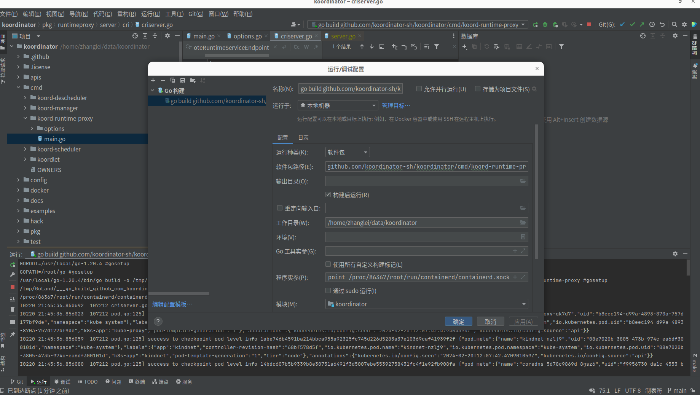
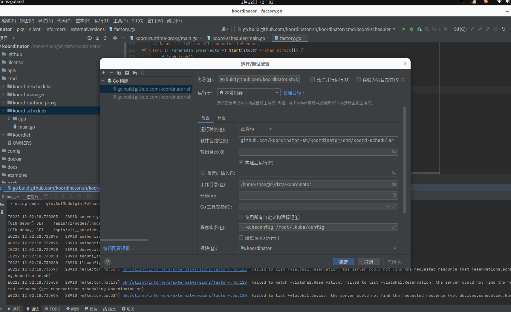
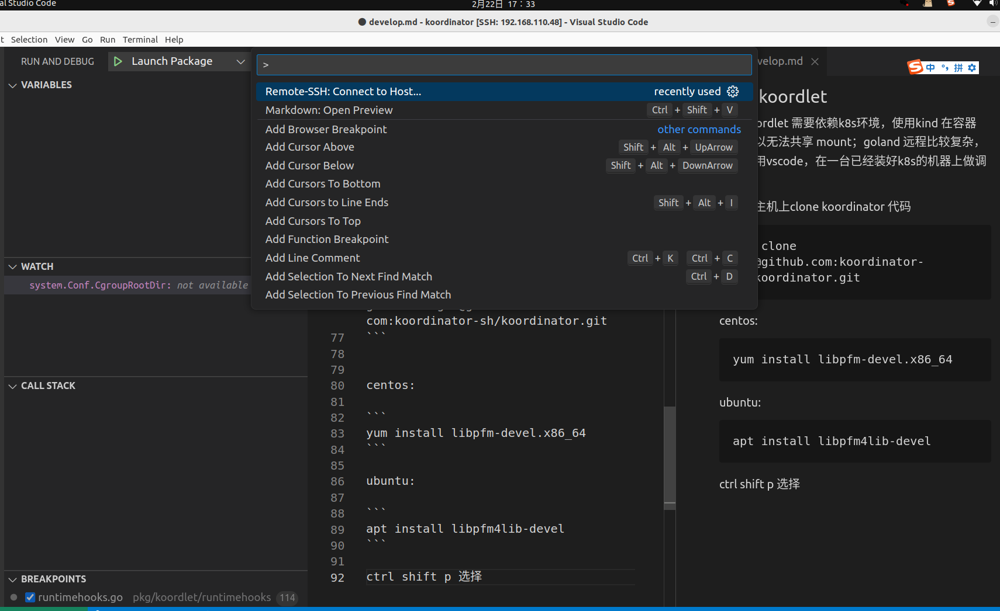
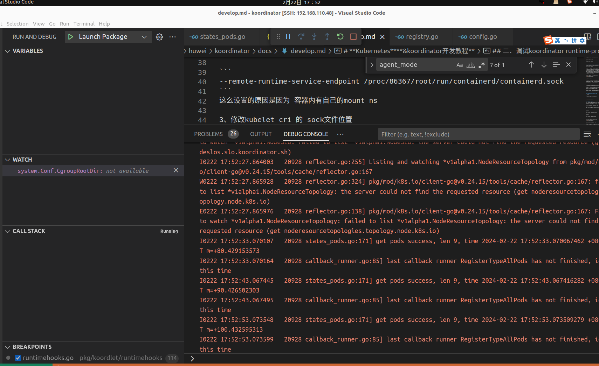

# **Kubernetes****&koordinator开发教程**

## golang 安装
Centos7.9
```
yum install golang
```

##  一．搭建开发环境

1．安装kind
需要搭建翻墙环境
```
 # For AMD64 / x86_64
[ $(uname -m) = x86_64 ] && curl -Lo ./kind https://kind.sigs.k8s.io/dl/v0.22.0/kind-linux-amd64
# For ARM64
[ $(uname -m) = aarch64 ] && curl -Lo ./kind https://kind.sigs.k8s.io/dl/v0.22.0/kind-linux-arm64
chmod +x ./kind
sudo mv ./kind /usr/local/bin/kind
 ```

2.创建测试环境集群

```
kind create cluster
```


## 二．调试koordinator runtime-proxy模块

1、查找 kubelet cri 的 unix sock 位置

ps aux|grep kubelet

```
root       86367  3.3  0.5 2480324 87696 ?       Ssl  20:07   1:17 /usr/bin/kubelet --bootstrap-kubeconfig=/etc/kubernetes/bootstrap-kubelet.conf --kubeconfig=/etc/kubernetes/kubelet.conf --config=/var/lib/kubelet/config.yaml --container-runtime-endpoint=unix:///run/containerd/containerd.sock --node-ip=172.18.0.2 --node-labels= --pod-infra-container-image=registry.k8s.io/pause:3.9 --provider-id=kind://docker/kind/kind-control-plane --fail-swap-on=false --cgroup-root=/kubelet
```

2、修改 goland 中runtimeproxy 启动参数



程序参数 设置为

```
--remote-runtime-service-endpoint /proc/86367/root/run/containerd/containerd.sock
```
这么设置的原因是因为 容器内有自己的mount ns

3、修改kubelet cri 的 sock文件位置

```
kubelet <other options> --container-runtime=remote --container-runtime-endpoint=unix:///var/run/koord-runtimeproxy/runtimeproxy.sock
```

4、如果使用kind 不知道如何修改sock文件位置
可以使用cri自制客户端，仓库代码:

```
https://github.com/LeiZhang-Hunter/cri-test
```


## 三、调试kube-scheduler 模块

加入参数 
```
--kubeconfig /root/.kube/config
```





## 四、调试 koordlet

由于koordlet 需要依赖k8s环境，使用kind 在容器内，所以无法共享 mount，这个模块依赖了内核里面的CGROUP，所以最好能在一台装好K8s 环境的主机上调试；goland 远程比较复杂，所以使用vscode，在一台已经装好k8s的机器上做调试

在远程主机上clone koordinator 代码

```
git clone git@github.com:koordinator-sh/koordinator.git
```


centos:

```
yum install libpfm-devel.x86_64
```

ubuntu:

```
apt install libpfm4lib-devel
```


ctrl shift p 选择连接外部主机：



如果连接外部主机失败请参考：

```
https://blog.csdn.net/qq_44743171/article/details/132775517
```

设置vscode lautch.json

```
{
    // Use IntelliSense to learn about possible attributes.
    // Hover to view descriptions of existing attributes.
    // For more information, visit: https://go.microsoft.com/fwlink/?linkid=830387
    "version": "0.2.0",
    "configurations": [
        {
            "name": "Launch Package",
            "type": "go",
            "request": "launch",
            "mode": "auto",
            "program": "/home/eoi/koordinator/cmd/koordlet",
            "env": {"NODE_NAME":"vm48", "agent_mode": "hostMode"},
            "args": [
                "-cgroup-root-dir=/sys/fs/",
                "-feature-gates=AllAlpha=true,AllBeta=true",
                "-runtime-hooks-network=unix",
                "-runtime-hooks-addr=/host-var-run-koordlet/koordlet.sock",
                "-runtime-hooks-host-endpoint=/var/run/koordlet//koordlet.sock",
                "--logtostderr=true",
                "--v=4",
            ],
        }
    ]
}
```

运行结果:



## 五 安装koordnaitor的k8s资源

如果报缺少一些资源 请去charts 上翻阅并且安装对应k8s资源,charts地址

```
https://github.com/koordinator-sh/charts/tree/main/versions/v1.4.0/templates
```
