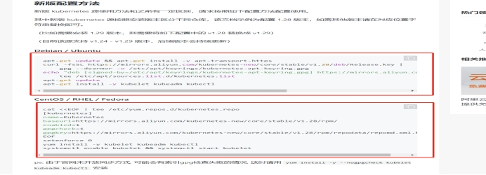

# **Kubernetes****&koordinator安装教程**

##  一．介绍

1．官网

```
 https://kubernetes.io/
 ```

2．必备工具安装

```
kubeadm、kubelet、 kubectl、Containerd 、helm
```


## 二．注意事项

- 1．kubeadm、kubelet、kubectl、Containerd 需要在每个pod机器上面添加。

- 2．Helm 只需要在master安装

## 三．安装

#### 1．先通过linux系统中的包管理工具安装好必备软件

#####（1）Kubernetes 安装

① 通过阿里云开源镜像仓库根据自己的linux 系统添加软件仓库、根据文档执行命令 https://developer.aliyun.com/mirror/kubernetes?spm=a2c6h.13651102.0.0.560a1b11dH2cm3



设置镜像源 Centos:

CentOS / RHEL / Fedora
```
cat <<EOF | tee /etc/yum.repos.d/kubernetes.repo
[kubernetes]
name=Kubernetes
baseurl=https://mirrors.aliyun.com/kubernetes-new/core/stable/v1.28/rpm/
enabled=1
gpgcheck=1
gpgkey=https://mirrors.aliyun.com/kubernetes-new/core/stable/v1.28/rpm/repodata/repomd.xml.key
EOF
setenforce 0
yum install -y kubelet kubeadm kubectl
systemctl enable kubelet && systemctl start kubele
```

Debian / Ubuntu
```
apt-get update && apt-get install -y apt-transport-https
curl -fsSL https://mirrors.aliyun.com/kubernetes-new/core/stable/v1.28/deb/Release.key |
    gpg --dearmor -o /etc/apt/keyrings/kubernetes-apt-keyring.gpg
echo "deb [signed-by=/etc/apt/keyrings/kubernetes-apt-keyring.gpg] https://mirrors.aliyun.com/kubernetes-new/core/stable/v1.28/deb/ /" |
    tee /etc/apt/sources.list.d/kubernetes.list
apt-get update
apt-get install -y kubelet kubeadm kubectl
```

#####（2）Containerd安装

① 直接通过添加docker 官方软件包源安装一个名为containerd.io 包

② Centos 安装教程 https://docs.docker.com/engine/install/centos/

③ Ubuntu 安装教程 https://docs.docker.com/engine/install/ubuntu/

④ 其它系统可以根据自己系统选择安装 https://docs.docker.com/engine/install/

Centos:
```
sudo yum install -y yum-utils
sudo yum-config-manager --add-repo https://download.docker.com/linux/centos/docker-ce.repo
sudo yum install containerd.io
```

#####（3）Helm 安装

① 根据官方文档选择好自己的系统进行安装https://helm.sh/zh/docs/intro/install/

```

```

## 四．启动Kubernetes

### 1．启动master节点

（1）打开配置文件 /etc/containerd/config.toml 下找到此文件。如果配置文件为空或者没有直接执行containerd config default >  /etc/containerd/config.toml 进行创建

（2）搜索配置文件中的SystemdCgroup 配置项，如果是false 改为true

（3）重启containerd sudo systemctl restart containerd

（4）Kubeadm init  --image-repository=lank8s.cn 进行初始化并生成配置信息,如果在国内可能会有墙的问题，所以需要指定一个仓库地址

### 2．启动node节点

（1）在node机器上面运行 Kubeadm  join .......... 在master节点初始化启动成功之后最后会返回加入的命令类似（Kubeadm  join  --token=”1123123”.....） ,直接复制过来就可以

## 五. 安装koordinator

1．先手动去github下载 koordinator-1.4.0 helm包

> https://github.com/koordinator-sh/charts/archive/refs/tags/koordinator-1.4.0.tar.gz

2．解压包到当前目录

```bash
  tar -zxvf koordinator-1.4.0.tar.gz
```

3．进入到解压的目录 执行

```bash
helm install koordinator {$PWD}/versions/v1.4.0
```


4．安装完成之后执行

```bash
kubectl get pod -A 
```

查看是否启动成功
