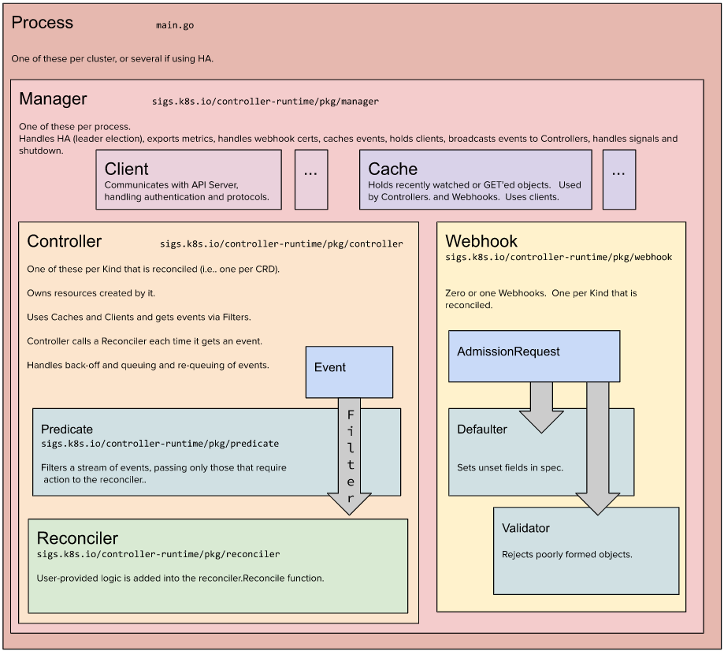
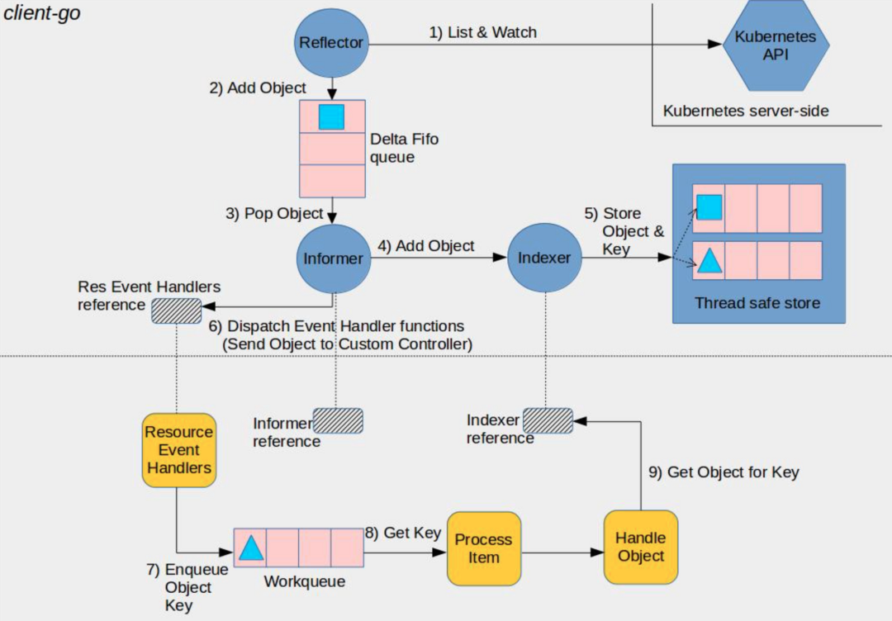

# KoordManager源码分析

## 一、简介

Koordinator Manager， 以Deployment的形式部署，通常由leader实例和backup实例组成。它是为了增强Kubernetes在混部场景下的资源调度能力而创建的，其中的三个组件Colocation Profile、SLO控制器和Recommender。

  - Colocation Profile，支持混部而无需修改工作负载。用户只需在集群中进行少量配置，原有的工作负载即可在混部模式下运行。
  - SLO控制器，用于资源超卖管理。根据节点混部时的运行状态，动态调整集群的超发配置比例。该控制器的核心职责是管理混部时的SLO，包括智能识别异常节点并降低其权重、动态调整混部时的水位和压力策略，以保证集群中pod的稳定性和吞吐量。
  - Recommender（即将推出），使用histograms统计和预测工作负载的资源使用细节，以预估工作负载的峰值资源需求，从而支持更好地分散热点，提高混部的效率。此外，资源profiling还可用于简化用户资源规范化配置的复杂性，如支持VPA。

## 二、controller-runtime

开源项目地址:

```
https://github.com/kubernetes-sigs/controller-runtime
```

controller-runtime 是基于 client-go 的 K8s 控制器开发框架，帮助开发者聚焦业务代码，快速高效的开发控制器。koord-manager 基于controller-runtime 实现了对nodeSlo、nodeMetric、 nodeResource的管控。



ControllerManager 正如其名，它会负责管理一个或多个控制器，其中一项重要工作就是初始化一个 K8s Client，上述故障中我们使用的 Client 正是由此而来。在创建 CtrMgr 的方法参数中，ctrl.Options 包含了 2 个重要配置项：新建 Cache 与 新建 Client。

Cache 接口定义了 2 个功能，一是维护一组 Informer，每个 Informer 持续监听（ListAndWatch）某一类（GVK） K8s 对象的资源事件，并按照特定的索引计算方式，将对象数据存储在本地缓存中；二是提供 Get/List 方法以读取 Informers 缓存的 K8s 对象。



图中展示了一个完整的基于 client-go 基础组件的控制器结构与功能流程，以贯穿全图的水平横线为界，上半部分描述了基于 List&Watch 的 Informer 机制，Informer 一方面将 K8s 对象缓存到 Indexer 中，另一方面为 K8s 资源事件注册各种 Handler，如果注册的 Handler 是将 事件的资源对象 key 存入一个队列中，那么就来到了图中的下半部分：WorkQueue + Reconciler，WorkQueue 类似一个消息队列，接收生产者（Informer 注册的 Handler）的消息（K8s objects key），并将消息持续提供给消费者（Reconciler），Reconciler 就是控制器的业务逻辑的核心所在。

controller-runtime 的 Cache 维护的一组 Informer，正是对应图中上半部分的内容，再将 Get/List 方法对接到每个 Informer 关联的 Indexer（真正保存缓存数据的对象） 上，就能实现以缓存的形式读取 K8s 资源的功能。

## Cache 和 Client 有什么关系

前文提到，新建的 Cache 将被用于创建 Client ，现在我们知道 Cache 实现了 Client 中的 Get/List 接口方法，一个直观的念头是，Cache 实现直接“塞进” Client 实现中就好了，Client 的所有 Get/List 都交给 Cache 来做。但实际是这样吗？我们看 NewClient 的源码注释：如果用户在创建 ControllerManager 时没有提供 NewClientFunc 方法，将使用 DelegatingClient 作为默认的 Client 实现，那我们继续探究一下 DelegatingClient 对象。

```
// sigs.k8s.io/controller-runtime/pkg/manager/manager.go:374
func DefaultNewClient(cache cache.Cache, config *rest.Config, options client.Options) (client.Client, error) {
    // 创建一个直接与 api-server 交互的客户端
    directC, err := client.New(config, options)
    if err != nil {
        return nil, err
    }

    return &client.DelegatingClient{
    // Reader 用于 Get/List 操作
        Reader: &client.DelegatingReader{
      // 新建的 cache 用在了这里
            CacheReader:  cache,
            ClientReader: directC,
        },
    // Writer 用于 Creat/Update/Delete 等写操作
        Writer:       directC,
    // StatusClient 用于对 Status 资源进行 Update/Patch 操作
        StatusClient: directC,
    }, nil
}
```

由源码可见，Cache 被用作了 DelegatingClient 中 Reader 的一部分 —— CacheReader，与之并列的还有一个不使用缓存、直连 api-server 的 ClientReader，为什么这里会用 2 个 Reader 呢？继续看 DelegatingReader 的源码。


```
// sigs.k8s.io/controller-runtimepkg/client/split.go:40
type DelegatingReader struct {
    CacheReader  Reader
    ClientReader Reader
}

// Get retrieves an obj for a given object key from the Kubernetes Cluster.
func (d *DelegatingReader) Get(ctx context.Context, key ObjectKey, obj runtime.Object) error {
  // 对承载 Get 结果的对象做类型断言
    _, isUnstructured := obj.(*unstructured.Unstructured)
  // 如果是 Unstructured 类型，则使用直连 api-server 的 client
    if isUnstructured {
        return d.ClientReader.Get(ctx, key, obj)
    }
  // 否则使用带有缓存机制的 client
    return d.CacheReader.Get(ctx, key, obj)
}
```

由源码可见，DelgatingClient 的 Get/List 操作由 DelegatingReader 实现，DelegatingReader 会根据调用方传入的对象类型（类型断言）来决定是从缓存中，还是从 api-server 读取 K8s 对象，调用示例如下：

```
  // ctrMgr 是基于默认配置创建的 ControllerManager 
  c := ctrMgr.GetClient()

  // 使用 typed object 方式调用 Get 时，将从缓存中获取对象
    rs := &appsv1.ReplicaSet{}
    c.Get(ctx, request.NamespacedName, rs)

  // 使用 untyped object (Unstructured) 方式调用 Get 时，将直接请求 api-server 获取对象
    rsU := &unstructured.Unstructured{}
    rsU.SetAPIVersion("apps/v1")
    rsU.SetKind("ReplicaSet")
    c.Get(ctx, request.NamespacedName, rsU)
```

至此，我们基本搞清楚了 ControllerManager 使用默认方式创建的 Client 中 Cache 的作用：Cache Reader 专用在 typed object 的 Get/List 操作上，而 untyped object 的 Get/List 、所有 Object 的写（Create/Update/Delete ,etc.）操作全部使用直连 api-server 的 Client。


# 三、源码分析

初始化controller-manager,带么位于：cmd/koord-manager/main.go

```
mgr, err := ctrl.NewManager(cfg, ctrl.Options{
	Scheme:                     options.Scheme,
	MetricsBindAddress:         metricsAddr,
	HealthProbeBindAddress:     healthProbeAddr,
	LeaderElection:             enableLeaderElection,
	LeaderElectionID:           "koordinator-manager",
	LeaderElectionNamespace:    leaderElectionNamespace,
	LeaderElectionResourceLock: leaderElectResourceLock,
	Namespace:                  namespace,
	SyncPeriod:                 syncPeriod,
	NewClient:                  utilclient.NewClient,
})
```

运行controller-manager

```
if err := mgr.Start(ctx); err != nil {
	setupLog.Error(err, "problem running manager")
	os.Exit(1)
}
```

## 创建 delegatingClient

创建初始化 delegatingClient，核心代码位于

```
// NewClient creates the default caching client with disable deepcopy list from cache.
func NewClient(cache cache.Cache, config *rest.Config, options client.Options, uncachedObjects ...client.Object) (client.Client, error) {
	c, err := client.New(config, options)
	if err != nil {
		return nil, err
	}

	uncachedGVKs := map[schema.GroupVersionKind]struct{}{}
	for _, obj := range uncachedObjects {
		gvk, err := apiutil.GVKForObject(obj, c.Scheme())
		if err != nil {
			return nil, err
		}
		uncachedGVKs[gvk] = struct{}{}
	}

	return &delegatingClient{
		scheme: c.Scheme(),
		mapper: c.RESTMapper(),
		Reader: &delegatingReader{
			CacheReader:      cache,
			ClientReader:     c,
			noDeepCopyLister: &noDeepCopyLister{cache: cache, scheme: c.Scheme()},
			scheme:           c.Scheme(),
			uncachedGVKs:     uncachedGVKs,
		},
		Writer:       c,
		StatusClient: c,
	}, nil
}
```

delegatingReader 读取数据的时候都会优先从缓存读取，缓存读取不到就会调用 client-go去 api server 读取

```

// Get retrieves an obj for a given object key from the Kubernetes Cluster.
func (d *delegatingReader) Get(ctx context.Context, key client.ObjectKey, obj client.Object) error {
	if isUncached, err := d.shouldBypassCache(obj); err != nil {
		return err
	} else if isUncached {
		return d.ClientReader.Get(ctx, key, obj)
	}
	return d.CacheReader.Get(ctx, key, obj)
}

// List retrieves list of objects for a given namespace and list options.
func (d *delegatingReader) List(ctx context.Context, list client.ObjectList, opts ...client.ListOption) error {
	if isUncached, err := d.shouldBypassCache(list); err != nil {
		return err
	} else if isUncached {
		return d.ClientReader.List(ctx, list, opts...)
	}
	if !disableNoDeepCopy && isDisableDeepCopy(opts) {
		return d.noDeepCopyLister.List(ctx, list, opts...)
	}
	return d.CacheReader.List(ctx, list, opts...)
}

```

### 安装要watcher的资源事件

初始化要watcher的资源类型

```

var controllerAddFuncs = map[string]func(manager.Manager) error{
	nodemetric.Name:   nodemetric.Add,
	noderesource.Name: noderesource.Add,
	nodeslo.Name:      nodeslo.Add,
	profile.Name:      profile.Add,
}
```

### nodemetric

安装 nodeMetric

```
// SetupWithManager sets up the controller with the Manager.
func (r *NodeMetricReconciler) SetupWithManager(mgr ctrl.Manager) error {
	handler := config.NewColocationHandlerForConfigMapEvent(r.Client, *sloconfig.NewDefaultColocationCfg(), r.Recorder)
	r.cfgCache = handler
	return ctrl.NewControllerManagedBy(mgr).
		For(&slov1alpha1.NodeMetric{}, builder.WithPredicates(predicate.GenerationChangedPredicate{})).
		Watches(&source.Kind{Type: &corev1.Node{}}, &EnqueueRequestForNode{}).
		Watches(&source.Kind{Type: &corev1.ConfigMap{}}, handler).
		Named(Name).
		Complete(r)
}

```

监听 自定义的 NodeMetric 指标是否发生变化如果发生变化触发 NodeMetricReconciler->Reconcile，具体实现源码位置：

```
pkg/slo-controller/nodemetric/nodemetric_controller.go
```

Reconcile 具体逻辑,会在node 或者 configMap 发生变化的时候触发

```
// +kubebuilder:rbac:groups=core,resources=nodes,verbs=get;list;watch
// +kubebuilder:rbac:groups=core,resources=configmaps,verbs=get;list;watch
// +kubebuilder:rbac:groups=slo.koordinator.sh,resources=nodemetrics,verbs=get;list;watch;create;update;patch;delete
// +kubebuilder:rbac:groups=slo.koordinator.sh,resources=nodemetrics/status,verbs=get;update;patch

// Reconcile is part of the main kubernetes reconciliation loop which aims to
// move the current state of the cluster closer to the desired state.
func (r *NodeMetricReconciler) Reconcile(ctx context.Context, req ctrl.Request) (ctrl.Result, error) {
	_ = log.FromContext(ctx, "node-metric-reconciler", req.NamespacedName)

	// 查看是否有 configuration.ColocationCfg 缓存，有的话返回true，没有的话从configMap中同步
	if !r.cfgCache.IsCfgAvailable() {
		// all nodes would be enqueued once the config is available, so here we just drop the req
		klog.Warningf("colocation config is not available, drop the req %v until a valid config is set",
			req.NamespacedName)
		return ctrl.Result{}, nil
	}

	node, nodeMetric := &corev1.Node{}, &slov1alpha1.NodeMetric{}
	nodeExist, nodeMetricExist := true, true
	nodeName, nodeMetricName := req.Name, req.Name

	// 检查是否有node信息
	if err := r.Client.Get(context.TODO(), req.NamespacedName, node); err != nil {
		if !errors.IsNotFound(err) {
			metrics.RecordNodeMetricReconcileCount(false, "reconcileNodeGetError")
			klog.Errorf("failed to find node %v, error: %v", nodeName, err)
			return ctrl.Result{Requeue: true}, err
		}
		nodeExist = false
	}

	// 检查是否有nodemetric信息
	if err := r.Client.Get(context.TODO(), req.NamespacedName, nodeMetric); err != nil {
		if !errors.IsNotFound(err) {
			metrics.RecordNodeMetricReconcileCount(false, "reconcileNodeMetricGetError")
			klog.Errorf("failed to find nodeMetric %v, error: %v", nodeMetricName, err)
			return ctrl.Result{Requeue: true}, err
		}
		nodeMetricExist = false
	}

	// 如果node 和 nodeMetric 都不存在，直接返回
	if !nodeExist && !nodeMetricExist {
		// return if neither Node nor NodeMetric exists.
		return ctrl.Result{}, nil
	} else if !nodeExist {
		// 如果node 不存在，删除nodeMetric
		if err := r.Client.Delete(context.TODO(), nodeMetric); err != nil {
			klog.Errorf("failed to delete nodeMetric %v, error: %v", nodeMetricName, err)
			if errors.IsNotFound(err) {
				return ctrl.Result{}, nil
			}
			metrics.RecordNodeMetricReconcileCount(false, "deleteNodeMetric")
			return ctrl.Result{Requeue: true}, err
		}
		metrics.RecordNodeMetricReconcileCount(true, "deleteNodeMetric")
		return ctrl.Result{}, nil
	} else if !nodeMetricExist {
		// 如果node存在，nodeMetric不存在，初始化nodemetric 并且创建
		if err := r.initNodeMetric(node, nodeMetric); err != nil {
			klog.Errorf("failed to init nodeMetric %v, error: %v", nodeMetricName, err)
			return ctrl.Result{Requeue: true}, err
		}
		if err := r.Client.Create(context.TODO(), nodeMetric); err != nil {
			metrics.RecordNodeMetricReconcileCount(false, "createNodeMetric")
			klog.Errorf("failed to create nodeMetric %v, error: %v", nodeMetricName, err)
			return ctrl.Result{Requeue: true}, err
		}
		metrics.RecordNodeMetricReconcileCount(true, "createNodeMetric")
	} else {
		// update nodeMetric spec if both exists
		nodeMetricSpec, err := r.getNodeMetricSpec(node, &nodeMetric.Spec)
		if err != nil {
			klog.Errorf("failed to get nodeMetric spec of %v: %v", nodeMetricName, err)
			return ctrl.Result{Requeue: true}, err
		}

		// 如果变动后的nodeMetric 和之前不一样，会同步更新本地缓存以及apiServer数据
		if !reflect.DeepEqual(nodeMetricSpec, &nodeMetric.Spec) {
			nodeMetric.Spec = *nodeMetricSpec
			err = r.Client.Update(context.TODO(), nodeMetric)
			if err != nil {
				metrics.RecordNodeMetricReconcileCount(false, "updateNodeMetric")
				klog.Errorf("failed to update nodeMetric %v, error: %v", nodeMetricName, err)
				return ctrl.Result{Requeue: true}, err
			}
			metrics.RecordNodeMetricReconcileCount(true, "updateNodeMetric")
		}
	}

	klog.V(6).Infof("nodemetric-controller succeeded to update nodeMetric %v", nodeMetricName)
	return ctrl.Result{}, nil
}
```

initNodeMetric 使用,initNodeMetric不会初始化metric指标，只会初始化托管策略（ColocationStrategy）

```
func (r *NodeMetricReconciler) initNodeMetric(node *corev1.Node, nodeMetric *slov1alpha1.NodeMetric) error {
	if node == nil || nodeMetric == nil {
		return fmt.Errorf("both Node and NodeMetric should not be empty")
	}

	nodeMetricSpec, err := r.getNodeMetricSpec(node, nil)
	if err != nil {
		return err
	}

	nodeMetric.Spec = *nodeMetricSpec
	nodeMetric.SetName(node.GetName())
	nodeMetric.SetNamespace(node.GetNamespace())

	return nil
}

```

nodeMetric 变动的数据源来自koordlet的stateInformer模块，具体实现位于

```
pkg/koordlet/statesinformer/impl/states_nodemetric.go
```

具体实现，在定时调用collectMetrics之后，使用updateStatus 更新到apiServer,用来更新nodeMetric

```
// 从tsdb 里读取 nodeMetric数据
nodeMetricInfo, podMetricInfo, hostAppMetricInfo, prodReclaimableMetric := r.collectMetric()
if nodeMetricInfo == nil {
	klog.Warningf("node metric is not ready, skip this round.")
	return
}

newStatus := &slov1alpha1.NodeMetricStatus{
	UpdateTime:            &metav1.Time{Time: time.Now()},
	NodeMetric:            nodeMetricInfo,
	PodsMetric:            podMetricInfo,
	HostApplicationMetric: hostAppMetricInfo,
	ProdReclaimableMetric: prodReclaimableMetric,
}
retErr := retry.RetryOnConflict(retry.DefaultBackoff, func() error {
	nodeMetric, err := r.nodeMetricLister.Get(r.nodeName)
	if errors.IsNotFound(err) {
		klog.Warningf("nodeMetric %v not found, skip", r.nodeName)
		return nil
	} else if err != nil {
		klog.Warningf("failed to get %s nodeMetric: %v", r.nodeName, err)
		return err
	}
	// 同步到apiserver
	err = r.statusUpdater.updateStatus(nodeMetric, newStatus)
	return err
})
```

### nodeResource 模块安装

