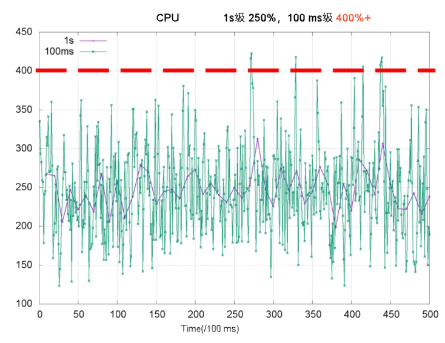

# koordlet源码分析

Koordlet 是部署在 Kubernetes 节点中的 DaemonSet，用于混部资源超卖、干扰检测、QoS 保障等。它由几个模块组成，分别负责信息收集、数据分析和 QoS 管理。 一些模块还提供了框架脚手架，提供了一组插件进行扩展（如"QoS Manager"），以便于添加新策略。

架构:



模块
Metrics Advisor
Metric Advisor 提供节点、Pod 和容器的资源使用和性能特征的基本信息。 它是一个独立的模块，定期收集、处理和导出资源画像。它还检测运行容器的干扰，例如 CPU 调度、内存分配延迟和压力阻塞信息（Pressure Stall Information, PSI）。 该信息将广泛用于资源超卖和 QoS 保障插件。

Storage
Storage 管理来自 Metrics Advisor 和 States Informer 的信息，提供一系列增删改查的API，并对过期数据定期清理。 它有两种类型的数据：静态和时间序列。时间序列类型存储历史数据用于统计目的，例如 CPU 和内存使用情况。静态类型包括节点、Pod 和容器的状态信息，例如节点的 CPU 信息、Pod 的元数据。

States Informer
States Informer 从 kube-apiserver 和 kubelet 同步节点和 Pod 状态，并将数据作为 static 类型保存到 Storage 中。与其他模块相比，该模块在开发迭代中应该保持相对稳定。

QoS Manager
QoS Manager 协调一组插件，这些插件负责按优先级保障 SLO，减少 Pod 之间的干扰。插件根据资源分析、干扰检测以及 SLO 策略配置，在不同场景下动态调整资源参数配置。通常来说，每个插件都会在资源调参过程中生成对应的执行计划。

QoS Manager 可能是迭代频率最高的模块，扩展了新的插件，更新了策略算法并添加了策略执行方式。 一个新的插件应该实现包含一系列标准API的接口，确保 QoS Manager 的核心部分简单且具有较好的可维护性。 高级插件（例如用于干扰检测的插件）会随着时间的推移变得更加复杂，在孵化已经稳定在 QoS Manager 中之后，它可能会成为一个独立的模块。

Metrics Reporter
Metrics Reporter 从 Storage 中读取历史指标和状态数据，然后将它们合并并发送到 ApiServer，这些数据将被 Koordinator Manager 用于资源超卖模型管理。 Metrics Reporter 还支持针对不同混部场景的多种处理算法。

Runtime Hooks
Runtime Hooks 充当运行时 Hook 管理器的后端服务器。 Runtime Hook 管理器是一个 CRI 代理，它拦截CRI请求，调用后端服务器注入策略，如通过 Pod 优先级设置资源隔离参数，应用资源分配策略。 Runtime Hooks 提供了一个框架来维护不同类型的策略，并在容器的生命周期中提供灵活的扩展点。

例如 Pod 生命周期中的 LLC 隔离注入



## 一、分析环境

koordnator软件版本

```
v1.4.0
```

运行环境

```
ubuntu21.04
```

## NodeSLOSpec 解析

Koordinator 使用一个 ConfigMap 管理 SLO 配置。该 ConfigMap 被 slo-controller 所使用，它的名字和命名空间可以在 koord-manager 的启 动参数中指定（默认为 koordinator-system/slo-controller-config）。它分别包含了以下键值：

colocation-config：混部配置。例如，是否开启混部 Batch 资源，混部水位线。
resource-threshold-config：基于阈值的压制/驱逐策略的配置。例如，CPU 压制的阈值，内存驱逐的阈值。
resource-qos-config：QoS 特性的配置。例如，BE pods 的 Group Identity，LS pods 的内存 QoS，BE pods 的末级缓存划分。
cpu-burst-config：CPU Burst 特性的配置。例如，pod 的最大 burst 比例。
system-config：系统设定的配置。例如，全局内存最低水位线系数 min_free_kbytes。

配置层级
每个配置定义为集群级别和节点级别的形式。

例如，

```
type ColocationCfg struct {
ColocationStrategy `json:",inline"`
NodeConfigs        []NodeColocationCfg `json:"nodeConfigs,omitempty"`
}

type ResourceQOSCfg struct {
ClusterStrategy *slov1alpha1.ResourceQOSStrategy `json:"clusterStrategy,omitempty"`
NodeStrategies  []NodeResourceQOSStrategy        `json:"nodeStrategies,omitempty"`
}
```

集群级别配置用于设置全局配置，而节点级别则供用户调整部分节点的配置，特别是灰度部署的情况。

请注意，大部分可配置的字段都在组件内部（koordlet、koord-manager）有默认值，所以通常仅需要编辑变更的参数。

NodeSLO
SLO 配置的 data 字段会被 koord-manager 解析。Koord-manager 会检查配置数据是否合法，然后用解析后的配置更新到每个节点的 NodeSLO 对象中。 如果解析失败，koord-manager 会在 ConfigMap 对象上记录 Events，以警示 unmarshal 错误。对于 agent 组件 koordlet，它会 watch NodeSLO 的 Spec，并对节点的 QoS 特性进行调谐。

```
apiVersion: slo.koordinator.sh/v1alpha1
kind: NodeSLO
metadata:
  name: test-node
spec:
  cpuBurstStrategy: {}
  extensions: {}
  resourceQOSStrategy: {}
  systemStrategy: {}
  # parsed from the `resource-threshold-config` data
  resourceUsedThresholdWithBE:
    cpuSuppressPolicy: cpuset
    cpuSuppressThresholdPercent: 65
    enable: true
    memoryEvictThresholdPercent: 70
```

配置
参考版本：Koordinator v1.2

SLO 配置的模板如下：

```
apiVersion: v1
kind: ConfigMap
metadata:
  name: slo-controller-config
  namespace: koordinator-system
data:
  # colocation-config is the configuration for colocation.
  # Related features: Dynamic resource over-commitment, Load-aware scheduling, Load-aware descheduling.
  # - enable: whether to enable the colocation. If false, the reclaimed resources of the node allocatable (e.g. `kubernetes.io/batch-cpu`) will be removed.
  # - metricAggregateDurationSeconds: the aggregated duration of node metrics reporting.
  # - metricReportIntervalSeconds: the reporting interval of the node metrics.
  # - metricAggregatePolicy: policies of reporting node metrics in different durations.
  # - cpuReclaimThresholdPercent: the reclaim threshold for calculating the reclaimed cpu resource. Basically, the reclaimed resource cannot reclaim the unused resources which are exceeding the threshold.
  # - memoryReclaimThresholdPercent: the reclaim threshold for calculating the reclaimed memory resource. Basically, the reclaimed resource cannot reclaim the unused resources which are exceeding the threshold.
  # - memoryCalculatePolicy: the policy for calculating the reclaimable memory resource. If set to `request`, only unallocated memory resource of high-priority pods are reclaimable, and no allocated memory can be reclaimed.
  # - degradeTimeMinutes: the threshold duration to degrade the colocation for which the node metrics has not been updated.
  # - updateTimeThresholdSeconds: the threshold duration to force updating the reclaimed resources with the latest calculated result.
  # - resourceDiffThreshold: the threshold to update the reclaimed resources than which the calculated reclaimed resources is different from the current.
  # - nodeConfigs: the node-level configurations which matches the nodes via the node selector and overrides the cluster configuration.
  colocation-config: |
    {
      "enable": false,
      "metricAggregateDurationSeconds": 300,
      "metricReportIntervalSeconds": 60,
      "metricAggregatePolicy": {
        "durations": [
          "5m",
          "10m",
          "15m"
        ]
      },
      "cpuReclaimThresholdPercent": 60,
      "memoryReclaimThresholdPercent": 65,
      "memoryCalculatePolicy": "usage",
      "degradeTimeMinutes": 15,
      "updateTimeThresholdSeconds": 300,
      "resourceDiffThreshold": 0.1,
      "nodeConfigs": [
        {
          "name": "anolis",
          "nodeSelector": {
            "matchLabels": {
              "kubernetes.io/kernel": "anolis"
            }
          },
          "updateTimeThresholdSeconds": 360,
          "resourceDiffThreshold": 0.2
        }
      ]
    }
  # The configuration for threshold-based strategies.
  # Related features: BECPUSuppress, BEMemoryEvict, BECPUEvict.
  # - clusterStrategy: the cluster-level configuration.
  # - nodeStrategies: the node-level configurations which matches the nodes via the node selector and overrides the cluster configuration.
  # - enable: whether to enable the threshold-based strategies or not. If false, all threshold-based strategies are disabled. If set to true, CPU Suppress and Memory Evict are enabled by default.
  # - cpuSuppressThresholdPercent: the node cpu utilization threshold to suppress BE pods' usage.
  # - cpuSuppressPolicy: the policy of cpu suppression. If set to `cpuset`, the BE pods' `cpuset.cpus` will be reconciled when suppression. If set to `cfsQuota`, the BE pods' `cpu.cfs_quota_us` will be reconciled.
  # - memoryEvictThresholdPercent: the node memory utilization threshold to evict BE pods.
  # - memoryEvictLowerPercent: the node memory utilization threshold to stop the memory eviction. By default, `lowerPercent = thresholdPercent - 2`.
  # - cpuEvictBESatisfactionLowerPercent: the cpu satisfaction threshold to start the cpu eviction (also require to meet the BE util threshold).
  # - cpuEvictBEUsageThresholdPercent: the BE utilization (BEUsage / BERealLimit) threshold to start the cpu eviction (also require to meet the cpu satisfaction threshold).
  # - cpuEvictBESatisfactionUpperPercent: the cpu satisfaction threshold to stop the cpu eviction.
  # - cpuEvictTimeWindowSeconds: the time window of the cpu metrics for the cpu eviction.
  resource-threshold-config: |
    {
      "clusterStrategy": {
        "enable": false,
        "cpuSuppressThresholdPercent": 65,
        "cpuSuppressPolicy": "cpuset",
        "memoryEvictThresholdPercent": 70,
        "memoryEvictLowerPercent": 65,
        "cpuEvictBESatisfactionUpperPercent": 90,
        "cpuEvictBESatisfactionLowerPercent": 60,
        "cpuEvictBEUsageThresholdPercent": 90
      },
      "nodeStrategies": [
        {
          "name": "anolis",
          "nodeSelector": {
            "matchLabels": {
              "kubernetes.io/kernel": "anolis"
            }
          },
          "cpuEvictBEUsageThresholdPercent": 80
        }
      ]
    }
  # The configuration for QoS-based features.
  # Related features: CPUQoS (GroupIdentity), MemoryQoS (CgroupReconcile), ResctrlQoS.
  # - clusterStrategy: the cluster-level configuration.
  # - nodeStrategies: the node-level configurations which matches the nodes via the node selector and overrides the cluster configuration.
  # - lsrClass/lsClass/beClass: the configuration for pods of QoS LSR/LS/BE respectively. 
  # - cpuQOS: the configuration of CPU QoS.
  #   - enable: whether to enable CPU QoS. If set to `false`, the related cgroup configs will be reset to the system default.
  #   - groupIdentity: the priority level of the Group Identity ([-1, 2]). `2` means the highest priority, while `-1` means the lowest priority. Anolis OS required.
  # - memoryQOS: the configuration of Memory QoS.
  #   - enable: whether to enable Memory QoS. If set to `false`, the related cgroup configs will be reset to the system default.
  #   - minLimitPercent: the scale percentage for setting the `memory.min` based on the container's request. It enables the memory protection from the Linux memory reclaim.
  #   - lowLimitPercent: the scale percentage for setting the `memory.low` based on the container's request. It enables the memory soft protection from the Linux memory reclaim.
  #   - throttlingPercent: the scale percentage for setting the `memory.high` based on the container's limit. It enables the memory throttling in cgroup level.
  #   - wmarkRatio: the ratio of container-level asynchronous memory reclaim based on the container's limit. Anolis OS required.
  #   - wmarkScalePermill: the per-mill of container memory to reclaim in once asynchronous memory reclaim. Anolis OS required.
  #   - wmarkMinAdj: the adjustment percentage of global memory min watermark. It affects the reclaim priority when the node memory free is quite a few. Anolis OS required.
  # - resctrlQOS: the configuration of Resctrl (Intel RDT) QoS.
  #   - enable: whether to enable Resctrl QoS.
  #   - catRangeStartPercent: the starting percentage of the L3 Cache way partitioning. L3 CAT required.
  #   - catRangeEndPercent: the ending percentage of the L3 Cache way partitioning. L3 CAT required.
  #   - mbaPercent: the allocation percentage of the memory bandwidth. MBA required.
  resource-qos-config: |
    {
      "clusterStrategy": {
        "lsrClass": {
          "cpuQOS": {
            "enable": false,
            "groupIdentity": 2
          },
          "memoryQOS": {
            "enable": false,
            "minLimitPercent": 0,
            "lowLimitPercent": 0,
            "throttlingPercent": 0,
            "wmarkRatio": 95,
            "wmarkScalePermill": 20,
            "wmarkMinAdj": -25,
            "priorityEnable": 0,
            "priority": 0,
            "oomKillGroup": 0
          },
          "resctrlQOS": {
            "enable": false,
            "catRangeStartPercent": 0,
            "catRangeEndPercent": 100,
            "mbaPercent": 100
          }
        },
        "lsClass": {
          "cpuQOS": {
            "enable": false,
            "groupIdentity": 2
          },
          "memoryQOS": {
            "enable": false,
            "minLimitPercent": 0,
            "lowLimitPercent": 0,
            "throttlingPercent": 0,
            "wmarkRatio": 95,
            "wmarkScalePermill": 20,
            "wmarkMinAdj": -25,
            "priorityEnable": 0,
            "priority": 0,
            "oomKillGroup": 0
          },
          "resctrlQOS": {
            "enable": false,
            "catRangeStartPercent": 0,
            "catRangeEndPercent": 100,
            "mbaPercent": 100
          }
        },
        "beClass": {
          "cpuQOS": {
            "enable": false,
            "groupIdentity": -1
          },
          "memoryQOS": {
            "enable": false,
            "minLimitPercent": 0,
            "lowLimitPercent": 0,
            "throttlingPercent": 0,
            "wmarkRatio": 95,
            "wmarkScalePermill": 20,
            "wmarkMinAdj": 50,
            "priorityEnable": 0,
            "priority": 0,
            "oomKillGroup": 0
          },
          "resctrlQOS": {
            "enable": false,
            "catRangeStartPercent": 0,
            "catRangeEndPercent": 30,
            "mbaPercent": 100
          }
        }
      },
      "nodeStrategies": [
        {
          "name": "anolis",
          "nodeSelector": {
            "matchLabels": {
              "kubernetes.io/kernel": "anolis"
            }
          },
          "beClass": {
            "memoryQOS": {
              "wmarkRatio": 90
            }
          }
        }
      ]
    }
  # The configuration for the CPU Burst.
  # Related features: CPUBurst.
  # - clusterStrategy: the cluster-level configuration.
  # - nodeStrategies: the node-level configurations which matches the nodes via the node selector and overrides the cluster configuration.
  # - policy: the policy of CPU Burst. If set to `none`, the CPU Burst is disabled. If set to `auto`, the CPU Burst is fully enabled. If set to `cpuBurstOnly`, only the Linux CFS Burst feature is enabled.
  # - cpuBurstPercent: the percentage of Linux CFS Burst. It affects the value of `cpu.cfs_burst_us` of pod/container cgroups. It specifies the percentage to which the CPU limit can be increased by CPU Burst.
  # - cfsQuotaBurstPercent: the percentage of cfs quota burst. It affects the scaled ratio of `cpu.cfs_quota_us` of pod/container cgroups. It specifies the maximum percentage to which the value of cfs_quota in the cgroup parameters can be increased.
  # - cfsQuotaBurstPeriodSeconds: the maximum period of once cfs quota burst. It indicates that the time period in which the container can run with an increased CFS quota is unlimited.
  # - sharePoolThresholdPercent: the threshold of share pool utilization. If the share pool utilization is too high, CPU Burst will be stopped and reset to avoid machine overload.
  cpu-burst-config: |
    {
      "clusterStrategy": {
        "policy": "none",
        "cpuBurstPercent": 1000,
        "cfsQuotaBurstPercent": 300,
        "cfsQuotaBurstPeriodSeconds": -1,
        "sharePoolThresholdPercent": 50
      },
      "nodeStrategies": [
        {
          "name": "anolis",
          "nodeSelector": {
            "matchLabels": {
              "kubernetes.io/kernel": "anolis"
            }
          },
          "policy": "cfsQuotaBurstOnly",
          "cfsQuotaBurstPercent": 400
        }
      ]
    }
  # The configuration for system-level settings.
  # Related features: SystemConfig.
  # - clusterStrategy: the cluster-level configuration.
  # - nodeStrategies: the node-level configurations which matches the nodes via the node selector and overrides the cluster configuration.
  # - minFreeKbytesFactor: the factor for calculating the global minimum memory free watermark `/proc/sys/vm/min_free_kbytes`. `min_free_kbytes = minFreeKbytesFactor * nodeTotalMemory / 10000`.
  # - watermarkScaleFactor: the reclaim factor `/proc/sys/vm/watermark_scale_factor` in once global memory reclaim.
  # - memcgReapBackGround: whether to enable the reaper for orphan memory cgroups.
  system-config: |-
    {
      "clusterStrategy": {
        "minFreeKbytesFactor": 100,
        "watermarkScaleFactor": 150,
        "memcgReapBackGround": 0
      }
      "nodeStrategies": [
        {
          "name": "anolis",
          "nodeSelector": {
            "matchLabels": {
              "kubernetes.io/kernel": "anolis"
            }
          },
          "minFreeKbytesFactor": 100,
          "watermarkScaleFactor": 150
        }
      ]
    }
  # The configuration for host application settings.
  # - name: name of the host application.
  # - qos: QoS class of the application.
  # - cgroupPath: cgroup path of the application, the directory equals to `${base}/${parentDir}/${relativePath}`.
  # - cgroupPath.base: cgroup base dir of the application, the format is various across cgroup drivers.
  # - cgroupPath.parentDir: cgroup parent path under base dir. By default it is "host-latency-sensitive/" for LS and "host-latency-sensitive/" for BE.
  # - cgroupPath.relativePath: cgroup relative path under parent dir.
  host-application-config: |
    {
      "applications": [
        {
          "name": "nginx",
          "qos": "LS",
          "cgroupPath": {
            "base": "CgroupRoot",
            "parentDir": "host-latency-sensitive/",
            "relativePath": "nginx/"
          }
        }
      ]
    }
```

快速开始
通过 ConfigMap koordinator-system/slo-controller-config 检查当前的 SLO 配置。

```
$ kubectl get configmap -n koordinator-system slo-controller-config -o yaml
apiVersion: v1
kind: ConfigMap
metadata:
  annotations:
    meta.helm.sh/release-name: koordinator
    meta.helm.sh/release-namespace: default
  labels:
    app.kubernetes.io/managed-by: Helm
  name: slo-controller-config
  namespace: koordinator-system
data:
  colocation-config: |
    {
      "enable": false,
      "metricAggregateDurationSeconds": 300,
      "metricReportIntervalSeconds": 60,
      "cpuReclaimThresholdPercent": 60,
      "memoryReclaimThresholdPercent": 65,
      "memoryCalculatePolicy": "usage",
      "degradeTimeMinutes": 15,
      "updateTimeThresholdSeconds": 300,
      "resourceDiffThreshold": 0.1
    }
  resource-threshold-config: |
    {
      "clusterStrategy": {
        "enable": false
      }
    }
```

2.编辑 ConfigMap koordinator-system/slo-controller-config 来修改 SLO 配置。

```
$ kubectl edit configmap -n koordinator-system slo-controller-config
```

例如，ConfigMap 编辑如下：

```
data:
  # ...
  resource-threshold-config: |
    {
      "clusterStrategy": {
        "enable": true,
        "cpuSuppressThresholdPercent": 60,
        "cpuSuppressPolicy": "cpuset",
        "memoryEvictThresholdPercent": 60
      }
    }
```

3.确认 NodeSLO 是否成功下发。
注意：默认值会在 NodeSLO 中省略。

```
$ kubectl get nodeslo.slo.koordinator.sh test-node -o yaml
apiVersion: slo.koordinator.sh/v1alpha1
kind: NodeSLO
metadata:
  name: test-node
spec:
  # ...
  extensions: {}
  resourceUsedThresholdWithBE:
    cpuSuppressPolicy: cpuset
    cpuSuppressThresholdPercent: 60
    enable: true
    memoryEvictThresholdPercent: 60
```


## 源码解析 

### 启动模块分析

koordlet 核心模块初始化在 cmd/koordlet/main.go 中

```
d, err := agent.NewDaemon(cfg)
```

在 pkg/koordlet/koordlet.go 中NewDaemon 里主要初始化了 以下几个模块:

这个函数用来获取当前linux 主机的一些支持信息
```
system.InitSupportConfigs()
-> initJiffies // 本质是使用 getconf CLK_TCK 获取时钟精度
-> initCgroupsVersion // 判断是不是cgroupv2版本，通过 stat /sys/fs/cgroup 获取
-> collectVersionInfo // 主机信息	待理解
```

initCgroupsVersion 核心逻辑:
```
isUnifiedOnce.Do(func() {
	var st unix.Statfs_t
	err := unix.Statfs(unifiedMountpoint, &st)
	if err != nil {
		if os.IsNotExist(err) && userns.RunningInUserNS() {
			// ignore the "not found" error if running in userns
			klog.ErrorS(err, "%s missing, assuming cgroup v1", unifiedMountpoint)
			isUnified = false
			return
		}
		panic(fmt.Sprintf("cannot statfs cgroup root: %s", err))
	}
	isUnified = st.Type == unix.CGROUP2_SUPER_MAGIC
})
```

初始化 k8s 的client
```
kubeClient := clientset.NewForConfigOrDie(config.KubeRestConf)
crdClient := clientsetbeta1.NewForConfigOrDie(config.KubeRestConf)
topologyClient := topologyclientset.NewForConfigOrDie(config.KubeRestConf)
schedulingClient := v1alpha1.NewForConfigOrDie(config.KubeRestConf)
```

初始化指标的cache
```
metricCache, err := metriccache.NewMetricCache(config.MetricCacheConf)
```

初始化cgroup formatter

```
cgroupDriver := system.GetCgroupDriver()
system.SetupCgroupPathFormatter(cgroupDriver)
```

初始化指标收集器
```
collectorService := metricsadvisor.NewMetricAdvisor(config.CollectorConf, statesInformer, metricCache)
```

初始化 evictVersion

```
evictVersion, err := util.FindSupportedEvictVersion(kubeClient)
```

初始化qosManager

```
qosManager := qosmanager.NewQOSManager(config.QOSManagerConf, scheme, kubeClient, crdClient, nodeName, statesInformer, metricCache, config.CollectorConf, evictVersion)
```

初始化koordlet runtimeproxy的 server 插口

```
runtimeHook, err := runtimehooks.NewRuntimeHook(statesInformer, config.RuntimeHookConf)
```

最后使用run 调用各个模块

```
func (d *daemon) Run(stopCh <-chan struct{}) {
	defer utilruntime.HandleCrash()
	klog.Infof("Starting daemon")

	// start resource executor cache
	d.executor.Run(stopCh)

	go func() {
		if err := d.metricCache.Run(stopCh); err != nil {
			klog.Fatal("Unable to run the metric cache: ", err)
		}
	}()

	// start states informer
	go func() {
		if err := d.statesInformer.Run(stopCh); err != nil {
			klog.Fatal("Unable to run the states informer: ", err)
		}
	}()
	// wait for metric advisor sync
	if !cache.WaitForCacheSync(stopCh, d.statesInformer.HasSynced) {
		klog.Fatal("time out waiting for states informer to sync")
	}

	// start metric advisor
	go func() {
		if err := d.metricAdvisor.Run(stopCh); err != nil {
			klog.Fatal("Unable to run the metric advisor: ", err)
		}
	}()
	// wait for metric advisor sync
	if !cache.WaitForCacheSync(stopCh, d.metricAdvisor.HasSynced) {
		klog.Fatal("time out waiting for metric advisor to sync")
	}

	// start predict server
	go func() {
		if err := d.predictServer.Setup(d.statesInformer, d.metricCache); err != nil {
			klog.Fatal("Unable to setup the predict server: ", err)
		}
		if err := d.predictServer.Run(stopCh); err != nil {
			klog.Fatal("Unable to run the predict server: ", err)
		}
	}()

	// start qos manager
	go func() {
		if err := d.qosManager.Run(stopCh); err != nil {
			klog.Fatal("Unable to run the qosManager: ", err)
		}
	}()

	go func() {
		if err := d.runtimeHook.Run(stopCh); err != nil {
			klog.Fatal("Unable to run the runtimeHook: ", err)
		}
	}()

	klog.Info("Start daemon successfully")
	<-stopCh
	klog.Info("Shutting down daemon")
}

```

### metricCache 模块分析

metricCache 主要提供两种存储能力，具体代码实现位于 pkg/koordlet/metriccache/metric_cache.go中。

 - 1、存储[tsdb](https://www.taosdata.com/tsdb)
 - 2、内存存储，存储在sync.Map中。

### prediction 模块分析

提出峰值预测的目的是为了提高节点利用率并避免过载。 通过分析节点指标的趋势，我们可以估计峰值使用情况并实施更有效的超额分配策略。

节点预测主要在Koordlet和Koord-Manager中实现。 架构如下：


使用从 Metric Cache 检索到的节点和 Pod 指标，根据预测模型计算预测结果并检查点。

#### 1、PeakPredictServer

初始化predictServer,核心代码实现位于pkg/koordlet/prediction/predict_server.go

```
func NewPeakPredictServer(cfg *Config) PredictServer {
	return &peakPredictServer{
		cfg:          cfg,
		uidGenerator: &generator{},
		//models 里面存储了 单个pod 所有pod、系统CPU 内存使用情况
		models:       make(map[UIDType]*PredictModel),
		clock:        clock.RealClock{},
		hasSynced:    &atomic.Bool{},
		checkpointer: NewFileCheckpointer(cfg.CheckpointFilepath),
	}
}
```

peakPredictServer->Run 负责定时把数据写入peakPredictServer的models 属性中，用来在后续调用GetPrediction读取CPU内存的分位数数据的计算结果,peakPredictServer->Run 核心代码解析:

```
// 重置 models
unknownUIDs := p.restoreModels()
// 定时读取POD，全部POD 系统的CPU 内存的统计数据，写入models 中
go wait.Until(p.training, p.cfg.TrainingInterval, stopCh)
// 清除掉models 中过期统计
go wait.Until(p.gcModels, time.Minute, stopCh)
//检查节点数据
go wait.Until(p.doCheckpoint, time.Minute, stopCh)
```

GetPrediction 是peakPredictServer 给外部调用的接口，用来计算CPU 和 内存的分位数，现在支持P60、P90、P95、P98、max 等

```
func (p *peakPredictServer) GetPrediction(metric MetricDesc) (Result, error) {
	p.modelsLock.Lock()
	defer p.modelsLock.Unlock()
	model, ok := p.models[metric.UID]
	if !ok {
		return Result{}, fmt.Errorf("UID %v not found in predict server", metric.UID)
	}
	model.Lock.Lock()
	defer model.Lock.Unlock()
	//
	return Result{
		Data: map[string]v1.ResourceList{
			"p60": {
				v1.ResourceCPU:    *resource.NewMilliQuantity(int64(model.CPU.Percentile(0.6)*1000.0), resource.DecimalSI),
				v1.ResourceMemory: *resource.NewQuantity(int64(model.Memory.Percentile(0.6)), resource.BinarySI),
			},
			"p90": {
				v1.ResourceCPU:    *resource.NewMilliQuantity(int64(model.CPU.Percentile(0.9)*1000.0), resource.DecimalSI),
				v1.ResourceMemory: *resource.NewQuantity(int64(model.Memory.Percentile(0.9)), resource.BinarySI),
			},
			"p95": {
				v1.ResourceCPU:    *resource.NewMilliQuantity(int64(model.CPU.Percentile(0.95)*1000.0), resource.DecimalSI),
				v1.ResourceMemory: *resource.NewQuantity(int64(model.Memory.Percentile(0.95)), resource.BinarySI),
			},
			"p98": {
				v1.ResourceCPU:    *resource.NewMilliQuantity(int64(model.CPU.Percentile(0.98)*1000.0), resource.DecimalSI),
				v1.ResourceMemory: *resource.NewQuantity(int64(model.Memory.Percentile(0.98)), resource.BinarySI),
			},
			"max": {
				v1.ResourceCPU:    *resource.NewMilliQuantity(int64(model.CPU.Percentile(1.0)*1000.0), resource.DecimalSI),
				v1.ResourceMemory: *resource.NewQuantity(int64(model.Memory.Percentile(1.0)), resource.BinarySI),
			},
		},
	}, nil
}

```

#### 2、predictorFactory

predictorFactory 是一个关于峰值预测的模型，接口定义：

```

type Predictor interface {
	GetPredictorName() string
	AddPod(pod *v1.Pod) error
	GetResult() (v1.ResourceList, error)
}
```


大约有4个实例，分别是

```
1、minPredictor
2、emptyPredictor
3、podReclaimablePredictor
4、priorityReclaimablePredictor
```

这些工厂是用来度量可以回收多少内存和CPU的，回收的标准是 pod中各个子容器(包括init容器)的度量值总和 - pod 实际使用的值

##### (1) emptyPredictor

不需要关注。统一返回nil


##### (2) podReclaimablePredictor

我们在这里只介绍

addPod数据时候回判断pod 上是否有

```
koordinator.sh/priority-class
```

如果存在这个标签会继续执行逻辑，AddPod核心计算逻辑

```
// 获取pod的所有容器的request 总值
podRequests := util.GetPodRequest(pod, v1.ResourceCPU, v1.ResourceMemory)
	podCPURequest := podRequests[v1.ResourceCPU]
	podMemoryRequest := podRequests[v1.ResourceMemory]

	reclaimableCPUMilli := int64(0)
	reclaimableMemoryBytes := int64(0)

	// 计算安全边界
	ratioAfterSafetyMargin := float64(100+p.safetyMarginPercent) / 100
	// 计算可以回收的CPU值
	if p95CPU, ok := p95Resources[v1.ResourceCPU]; ok {
		peakCPU := util.MultiplyMilliQuant(p95CPU, ratioAfterSafetyMargin)
		reclaimableCPUMilli = podCPURequest.MilliValue() - peakCPU.MilliValue()
	}
	//计算可以回收的内存值
	if p98Memory, ok := p98Resources[v1.ResourceMemory]; ok {
		peakMemory := util.MultiplyQuant(p98Memory, ratioAfterSafetyMargin)
		reclaimableMemoryBytes = podMemoryRequest.Value() - peakMemory.Value()
	}

	// 记录到 reclaimable值里
	if reclaimableCPUMilli > 0 {
		cpu := p.reclaimable[v1.ResourceCPU]
		reclaimableCPU := resource.NewMilliQuantity(reclaimableCPUMilli, resource.DecimalSI)
		pu.Add(*reclaimableCPU)
		p.reclaimable[v1.ResourceCPU] = cpu
	}
	if reclaimableMemoryBytes > 0 {
		memory := p.reclaimable[v1.ResourceMemory]
		reclaimableMemory := resource.NewQuantity(reclaimableMemoryBytes, resource.BinarySI)
		memory.Add(*reclaimableMemory)
		p.reclaimable[v1.ResourceMemory] = memory
	}
```

GetResult 返回还可以回收多少内存和CPU资源

```

// GetResult returns the predicted resource list for the added pods.
func (p *podReclaimablePredictor) GetResult() (v1.ResourceList, error) {
	metrics.RecordNodePredictedResourceReclaimable(string(v1.ResourceCPU), metrics.UnitCore, p.GetPredictorName(), float64(p.reclaimable.Cpu().MilliValue())/1000)
	metrics.RecordNodePredictedResourceReclaimable(string(v1.ResourceMemory), metrics.UnitByte, p.GetPredictorName(), float64(p.reclaimable.Memory().Value()))
	return p.reclaimable, nil
}
```

##### (3) priorityReclaimablePredictor

podReclaimablePredictor 只会计算 pod上标注优先级为koord-prod 或者空的,和podReclaimablePredictor区别主要是和podReclaimablePredictor是计算pod维度的客户收预测量，而priorityReclaimablePredictor是product优先级级别的

```

func (n *priorityReclaimablePredictor) GetResult() (v1.ResourceList, error) {
	// get sys prediction
	sysResult, err := n.predictServer.GetPrediction(MetricDesc{UID: getNodeItemUID(SystemItemID)})
	if err != nil {
		return nil, fmt.Errorf("failed to get prediction of sys, err: %w", err)
	}
	sysResultForCPU := sysResult.Data["p95"]
	sysResultForMemory := sysResult.Data["p98"]
	reclaimPredict := v1.ResourceList{
		v1.ResourceCPU:    *sysResultForCPU.Cpu(),
		v1.ResourceMemory: *sysResultForMemory.Memory(),
	}

	// 遍历所有优先级，只找到优先级为koord-prod或者空的预测量
	// get reclaimable priority class prediction,
	for _, priorityClass := range extension.KnownPriorityClasses {
		if !n.priorityClassFilterFn(priorityClass) {
			continue
		}

		result, err := n.predictServer.GetPrediction(MetricDesc{UID: getNodeItemUID(string(priorityClass))})
		if err != nil {
			return nil, fmt.Errorf("failed to get prediction of priority %s, err: %s", priorityClass, err)
		}

		resultForCPU := result.Data["p95"]
		resultForMemory := result.Data["p98"]
		predictResource := v1.ResourceList{
			v1.ResourceCPU:    *resultForCPU.Cpu(),
			v1.ResourceMemory: *resultForMemory.Memory(),
		}
		reclaimPredict = quotav1.Add(reclaimPredict, predictResource)
	}

	// scale with the safety margin
	ratioAfterSafetyMargin := float64(100+n.safetyMarginPercent) / 100
	reclaimPredict = v1.ResourceList{
		v1.ResourceCPU:    util.MultiplyMilliQuant(*reclaimPredict.Cpu(), ratioAfterSafetyMargin),
		v1.ResourceMemory: util.MultiplyQuant(*reclaimPredict.Memory(), ratioAfterSafetyMargin),
	}

	// reclaimable[P] := max(request[P] - peak[P], 0)
	// 优先级下所有资源request用量 - 优先级下的实际用量
	reclaimable := quotav1.Max(quotav1.Subtract(n.reclaimRequest, reclaimPredict), util.NewZeroResourceList())
	metrics.RecordNodePredictedResourceReclaimable(string(v1.ResourceCPU), metrics.UnitCore, n.GetPredictorName(), float64(reclaimable.Cpu().MilliValue())/1000)
	metrics.RecordNodePredictedResourceReclaimable(string(v1.ResourceMemory), metrics.UnitByte, n.GetPredictorName(), float64(reclaimable.Memory().Value()))
	// 返回结果
	return reclaimable, nil
}
```

##### 4、minPredictor

minPredictor 是从上面所有预测器里找到最小预测值，并且返回

```
func (m *minPredictor) GetResult() (v1.ResourceList, error) {
	if len(m.predictors) <= 0 {
		return util.NewZeroResourceList(), nil
	}

	minimal, err := m.predictors[0].GetResult()
	if err != nil {
		return nil, fmt.Errorf("failed to get predictor %s result, error: %v", m.predictors[0].GetPredictorName(), err)
	}
	for i := 1; i < len(m.predictors); i++ {
		result, err := m.predictors[i].GetResult()
		if err != nil {
			return nil, fmt.Errorf("failed to get predictor %s result, error: %v", m.predictors[i].GetPredictorName(), err)
		}

		minimal = util.MinResourceList(minimal, result)
	}

	klog.V(6).Infof("minPredictor get result: %+v", minimal)
	metrics.RecordNodePredictedResourceReclaimable(string(v1.ResourceCPU), metrics.UnitCore, m.GetPredictorName(), float64(minimal.Cpu().MilliValue())/1000)
	metrics.RecordNodePredictedResourceReclaimable(string(v1.ResourceMemory), metrics.UnitByte, m.GetPredictorName(), float64(minimal.Memory().Value()))
	return minimal, nil
}
```

### statesInformer

States Informer 从 kube-apiserver 和 kubelet 同步节点和 Pod 状态，并将数据作为 static 类型保存到 Storage 中。与其他模块相比，该模块在开发迭代中应该保持相对稳定。


statesInformer 是和k8s api server 通讯的类，用来监听常用资源的变动并且同步到缓存中，如果是负载资源变动，会调用 predictorFactory 的AddPod 接口，同步峰值预测的CPU和内存的量值，支持的插件列表如下:

```
// NOTE: variables in this file can be overwritten for extension

var DefaultPluginRegistry = map[PluginName]informerPlugin{
	// 同步node信息
	nodeSLOInformerName:    NewNodeSLOInformer(),
	// pvc 信息
	pvcInformerName:        NewPVCInformer(),
	// 收集node 拓扑信息
	nodeTopoInformerName:   NewNodeTopoInformer(),
	// 
	nodeInformerName:       NewNodeInformer(),
	// 收集pod信息监听pod变化
	podsInformerName:       NewPodsInformer(),
	// 收集node信息变化
	nodeMetricInformerName: NewNodeMetricInformer(),
}
```

statesInformer->Run 运行所有插件

```
klog.V(2).Infof("starting informer plugins")
s.setupPlugins()
s.startPlugins(stopCh)
```

#### (1) nodeSLOInformer

 SLO(Service Level Objectives)来定义集群性能的衡量标准和集群性能要达到的目标。

nodeSLO 是 koordinator 定制的一个CRD资源，代码位置在：

```
apis/slo/v1alpha1/nodeslo_types.go
```

具体定义:

```
// +genclient
// +genclient:nonNamespaced
// +kubebuilder:object:root=true
// +kubebuilder:resource:scope=Cluster
// +kubebuilder:subresource:status

// NodeSLO is the Schema for the nodeslos API
type NodeSLO struct {
	metav1.TypeMeta   `json:",inline"`
	metav1.ObjectMeta `json:"metadata,omitempty"`

	Spec   NodeSLOSpec   `json:"spec,omitempty"`
	Status NodeSLOStatus `json:"status,omitempty"`
}

```

nodeSLOInformer 主要用来同步这个crd变化并且放到缓存里


```
func (s *nodeSLOInformer) Setup(ctx *PluginOption, state *PluginState) {
	s.nodeSLOInformer = newNodeSLOInformer(ctx.KoordClient, ctx.NodeName)
	s.nodeSLOInformer.AddEventHandler(cache.ResourceEventHandlerFuncs{
		// 监听添加nodeslo
		AddFunc: func(obj interface{}) {
			nodeSLO, ok := obj.(*slov1alpha1.NodeSLO)
			if ok {
				// 同步到缓存中
				s.updateNodeSLOSpec(nodeSLO)
				klog.Infof("create NodeSLO %v", util.DumpJSON(nodeSLO))
			} else {
				klog.Errorf("node slo informer add func parse nodeSLO failed")
			}
		},
		// 监听更新同步到nodeslo
		UpdateFunc: func(oldObj, newObj interface{}) {
			oldNodeSLO, oldOK := oldObj.(*slov1alpha1.NodeSLO)
			newNodeSLO, newOK := newObj.(*slov1alpha1.NodeSLO)
			if !oldOK || !newOK {
				klog.Errorf("unable to convert object to *slov1alpha1.NodeSLO, old %T, new %T", oldObj, newObj)
				return
			}
			if reflect.DeepEqfunc (s *nodeSLOInformer) Setup(ctx *PluginOption, state *PluginState) {
	s.nodeSLOInformer = newNodeSLOInformer(ctx.KoordClient, ctx.NodeName)
	s.nodeSLOInformer.AddEventHandler(cache.ResourceEventHandlerFuncs{
		AddFunc: func(obj interface{}) {
			nodeSLO, ok := obj.(*slov1alpha1.NodeSLO)
			if ok {
				s.updateNodeSLOSpec(nodeSLO)
				klog.Infof("create NodeSLO %v", util.DumpJSON(nodeSLO))
			} else {
				klog.Errorf("node slo informer add func parse nodeSLO failed")
			}
		},
		UpdateFunc: func(oldObj, newObj interface{}) {
			oldNodeSLO, oldOK := oldObj.(*slov1alpha1.NodeSLO)
			newNodeSLO, newOK := newObj.(*slov1alpha1.NodeSLO)
			if !oldOK || !newOK {
				klog.Errorf("unable to convert object to *slov1alpha1.NodeSLO, old %T, new %T", oldObj, newObj)
				return
			}
			// 检查是否有变化
			if reflect.DeepEqual(oldNodeSLO.Spec, newNodeSLO.Spec) {
				klog.V(5).Infof("find NodeSLO spec %s has not changed", newNodeSLO.Name)
				return
			}
			klog.Infof("update NodeSLO spec %v", util.DumpJSON(newNodeSLO.Spec))
			// 更新同步到缓存中
			s.updateNodeSLOSpec(newNodeSLO)
		},
	})
	s.callbackRunner = state.callbackRunner
}ual(oldNodeSLO.Spec, newNodeSLO.Spec) {
				klog.V(5).Infof("find NodeSLO spec %s has not changed", newNodeSLO.Name)
				return
			}
			klog.Infof("update NodeSLO spec %v", util.DumpJSON(newNodeSLO.Spec))
			s.updateNodeSLOSpec(newNodeSLO)
		},
	})
	s.callbackRunner = state.callbackRunner
}
```

对外暴露接口获取配置

```

func (s *nodeSLOInformer) GetNodeSLO() *slov1alpha1.NodeSLO {
	s.nodeSLORWMutex.RLock()
	defer s.nodeSLORWMutex.RUnlock()
	return s.nodeSLO.DeepCopy()
}
```

#### (2)pvcInformer

pvcInformer 监听pvc 变化，同步pvc 信息到volumeNameMap中


```
func NewPVCInformer() *pvcInformer {
	return &pvcInformer{
		volumeNameMap: map[string]string{},
	}
}
```

对外暴露接口:

```
func (s *pvcInformer) GetVolumeName(pvcNamespace, pvcName string) string {
	s.pvcRWMutex.RLock()
	defer s.pvcRWMutex.RUnlock()
	return s.volumeNameMap[util.GetNamespacedName(pvcNamespace, pvcName)]
}

```

#### (3) nodeTopoInformer

这个informer 核心功能是定时调用nodeTopoInformer->reportNodeTopology,核心代码位于pkg/koordlet/statesinformer/impl/states_noderesourcetopology

#### (4) nodeInformer
监听node变化
```
func (s *nodeInformer) Setup(ctx *PluginOption, state *PluginState) {
	s.callbackRunner = state.callbackRunner

	s.nodeInformer = newNodeInformer(ctx.KubeClient, ctx.NodeName)
	s.nodeInformer.AddEventHandler(cache.ResourceEventHandlerFuncs{
		AddFunc: func(obj interface{}) {
			node, ok := obj.(*corev1.Node)
			if ok {
				s.syncNode(node)
			} else {
				klog.Errorf("node informer add func parse Node failed, obj %T", obj)
			}
		},
		UpdateFunc: func(oldObj, newObj interface{}) {
			oldNode, oldOK := oldObj.(*corev1.Node)
			newNode, newOK := newObj.(*corev1.Node)
			if !oldOK || !newOK {
				klog.Errorf("unable to convert object to *corev1.Node, old %T, new %T", oldObj, newObj)
				return
			}
			if newNode.ResourceVersion == oldNode.ResourceVersion {
				klog.V(5).Infof("find node %s has not changed", newNode.Name)
				return
			}
			s.syncNode(newNode)
		},
	})
}
```

同步记录 node 申请的batch-cpu、batch-memory、mid-cpu、mid-memory

```
func recordNodeResources(node *corev1.Node) {
	if node == nil || node.Status.Allocatable == nil {
		klog.V(4).Infof("failed to record node resources metrics, node is invalid: %v", node)
		return
	}

	// record node allocatable of BatchCPU & BatchMemory
	batchCPU := node.Status.Allocatable.Name(apiext.BatchCPU, resource.DecimalSI)
	metrics.RecordNodeResourceAllocatable(string(apiext.BatchCPU), metrics.UnitInteger, float64(batchCPU.Value()))
	batchMemory := node.Status.Allocatable.Name(apiext.BatchMemory, resource.BinarySI)
	metrics.RecordNodeResourceAllocatable(string(apiext.BatchMemory), metrics.UnitByte, float64(batchMemory.Value()))

	// record node allocatable of MidCPU & MidMemory
	midCPU := node.Status.Allocatable.Name(apiext.MidCPU, resource.DecimalSI)
	metrics.RecordNodeResourceAllocatable(string(apiext.MidCPU), metrics.UnitInteger, float64(midCPU.Value()))
	midMemory := node.Status.Allocatable.Name(apiext.MidMemory, resource.BinarySI)
	metrics.RecordNodeResourceAllocatable(string(apiext.MidMemory), metrics.UnitByte, float64(midMemory.Value()))
}

```

#### (5) podInformer

当有pod变化时候，核心同步的函数是 syncPods，核心代码位于

```
pkg/koordlet/statesinformer/impl/states_pods.go
```

同步pod信息

```
func (s *podsInformer) syncPods() error {
	// 拉取pod列表
	podList, err := s.kubelet.GetAllPods()

	// when kubelet recovers from crash, podList may be empty.
	if err != nil || len(podList.Items) == 0 {
		klog.Warningf("get pods from kubelet failed, err: %v", err)
		return err
	}
	newPodMap := make(map[string]*statesinformer.PodMeta, len(podList.Items))
	// reset pod container metrics
	resetPodMetrics()
	for i := range podList.Items {
		pod := &podList.Items[i]
		podMeta := &statesinformer.PodMeta{
			Pod:       pod, // no need to deep-copy from unmarshalled
			CgroupDir: genPodCgroupParentDir(pod),
		}
		// 同步pod 元数据到newPodMap
		newPodMap[string(pod.UID)] = podMeta
		// record pod container metrics
		// 记录pod 中容器的指标
		recordPodResourceMetrics(podMeta)
	}
	s.podRWMutex.Lock()
	s.podMap = newPodMap
	s.podRWMutex.Unlock()

	s.podHasSynced.Store(true)
	s.podUpdatedTime = time.Now()
	klog.V(4).Infof("get pods success, len %d, time %s", len(s.podMap), s.podUpdatedTime.String())
	s.callbackRunner.SendCallback(statesinformer.RegisterTypeAllPods)
	return nil
}

```

recordPodResourceMetrics 负责同步的request和limit的batch-cpu、batch-memory、mid-cpu、mid-memory 到prometheus 指标中

```
func recordPodResourceMetrics(podMeta *statesinformer.PodMeta) {
	if podMeta == nil || podMeta.Pod == nil {
		klog.V(5).Infof("failed to record pod resources metric, pod is invalid: %v", podMeta)
		return
	}
	pod := podMeta.Pod

	// record (regular) container metrics
	containerStatusMap := map[string]*corev1.ContainerStatus{}
	for i := range pod.Status.ContainerStatuses {
		containerStatus := &pod.Status.ContainerStatuses[i]
		containerStatusMap[containerStatus.Name] = containerStatus
	}
	for i := range pod.Spec.Containers {
		c := &pod.Spec.Containers[i]
		containerStatus, ok := containerStatusMap[c.Name]
		if !ok {
			klog.V(6).Infof("skip record container resources metric, container %s/%s/%s status not exist",
				pod.Namespace, pod.Name, c.Name)
			continue
		}
		recordContainerResourceMetrics(c, containerStatus, pod)
	}

	klog.V(6).Infof("record pod prometheus metrics successfully, pod %s/%s", pod.Namespace, pod.Name)
}
```

#### (6) nodeMetricInformer

这快代码位于

```
pkg/koordlet/statesinformer/impl/states_nodemetric.go
```

监听nodeMetric变化

```
r.nodeMetricInformer.AddEventHandler(cache.ResourceEventHandlerFuncs{
		AddFunc: func(obj interface{}) {
			nodeMetric, ok := obj.(*slov1alpha1.NodeMetric)
			if ok {
				r.updateMetricSpec(nodeMetric)
			} else {
				klog.Errorf("node metric informer add func parse nodeMetric failed")
			}
		},
		UpdateFunc: func(oldObj, newObj interface{}) {
			oldNodeMetric, oldOK := oldObj.(*slov1alpha1.NodeMetric)
			newNodeMetric, newOK := newObj.(*slov1alpha1.NodeMetric)
			if !oldOK || !newOK {
				klog.Errorf("unable to convert object to *slov1alpha1.NodeMetric, old %T, new %T", oldObj, newObj)
				return
			}

			if newNodeMetric.Generation == oldNodeMetric.Generation || reflect.DeepEqual(oldNodeMetric.Spec, newNodeMetric.Spec) {
				klog.V(5).Infof("find nodeMetric spec %s has not changed.", newNodeMetric.Name)
				return
			}
			klog.V(2).Infof("update node metric spec %v", newNodeMetric.Spec)
			r.updateMetricSpec(newNodeMetric)
		},
	})
```

更新到内存中:

```

func (r *nodeMetricInformer) updateMetricSpec(newNodeMetric *slov1alpha1.NodeMetric) {
	r.rwMutex.Lock()
	defer r.rwMutex.Unlock()
	if newNodeMetric == nil {
		klog.Error("failed to merge with nil nodeMetric, new is nil")
		return
	}
	r.nodeMetric = newNodeMetric.DeepCopy()
	data, _ := json.Marshal(newNodeMetric.Spec)
	r.nodeMetric.Spec = *defaultNodeMetricSpec.DeepCopy()
	_ = json.Unmarshal(data, &r.nodeMetric.Spec)
}
```

nodeMetricInformer 还会定时同步metric到 prodPredictor 和 statusUpdater。
nodeMetricInformer的collectMetric是一个十分重要的函数

```
// 初始化峰值预测器
prodPredictor := r.predictorFactory.New(prediction.ProdReclaimablePredictor)

	// 遍历pod指标
	for _, podMeta := range podsMeta {
		podMetric, err := r.collectPodMetric(podMeta, queryParam)
		if err != nil {
			klog.Warningf("query pod metric failed, pod %s, err: %v", podMeta.Key(), err)
			continue
		}
		// predict pods which have valid metrics; ignore prediction failures
		// 将pod 信息加入峰值预测器中
		err = prodPredictor.AddPod(podMeta.Pod)
		if err != nil {
			klog.V(4).Infof("predictor add pod aborted, pod %s, err: %v", podMeta.Key(), err)
		}

		r.fillExtensionMap(podMetric, podMeta.Pod)
		// 填充gpu 信息到pod中
		if len(gpus) > 0 {
			r.fillGPUMetrics(queryParam, podMetric, string(podMeta.Pod.UID), gpus)
		}
		podsMetricInfo = append(podsMetricInfo, podMetric)
	}
```

同步到statusUpdater，nodeMetricInformer->sync

```
//收集指标
nodeMetricInfo, podMetricInfo, hostAppMetricInfo, prodReclaimableMetric := r.collectMetric()
	if nodeMetricInfo == nil {
		klog.Warningf("node metric is not ready, skip this round.")
		return
	}

// 初始化 NodeMetricStatus
newStatus := &slov1alpha1.NodeMetricStatus{
	UpdateTime:            &metav1.Time{Time: time.Now()},
	NodeMetric:            nodeMetricInfo,
	PodsMetric:            podMetricInfo,
	HostApplicationMetric: hostAppMetricInfo,
	ProdReclaimableMetric: prodReclaimableMetric,
}

retErr := retry.RetryOnConflict(retry.DefaultBackoff, func() error {
	nodeMetric, err := r.nodeMetricLister.Get(r.nodeName)
	if errors.IsNotFound(err) {
		klog.Warningf("nodeMetric %v not found, skip", r.nodeName)
		return nil
	} else if err != nil {
		klog.Warningf("failed to get %s nodeMetric: %v", r.nodeName, err)
		return err
	}
	// 更新status
	err = r.statusUpdater.updateStatus(nodeMetric, newStatus)
	return err
})

```

### CGROUP 驱动

安装cgroup驱动

```
cgroupDriver := system.GetCgroupDriver()
	system.SetupCgroupPathFormatter(cgroupDriver)
```

判断cgroup 驱动是systemd 还是cgroupfs,其实就是判断存在kubepods 或者 kubepods.slice

```
func GetCgroupDriverFromCgroupName() CgroupDriverType {
	isSystemd := FileExists(filepath.Join(GetRootCgroupSubfsDir(CgroupCPUDir), KubeRootNameSystemd))
	if isSystemd {
		return Systemd
	}

	isCgroupfs := FileExists(filepath.Join(GetRootCgroupSubfsDir(CgroupCPUDir), KubeRootNameCgroupfs))
	if isCgroupfs {
		return Cgroupfs
	}

	return ""
}

```

### MetricAdvisor

核心代码位于:

```
pkg/koordlet/metricsadvisor/metrics_advisor.go
```

Metric Advisor 提供节点、Pod 和容器的资源使用和性能特征的基本信息。 它是一个独立的模块，定期收集、处理和导出资源画像。它还检测运行容器的干扰，例如 CPU 调度、内存分配延迟和压力阻塞信息（Pressure Stall Information, PSI）。 该信息将广泛用于资源超卖和 QoS 保障插件。

metricAdvisor 目前支持的采集模块

```
// 收集gpu 数据
devicePlugins = map[string]framework.DeviceFactory{
	gpu.DeviceCollectorName: gpu.New,
}

collectorPlugins = map[string]framework.CollectorFactory{
	// 收集节点资源
	noderesource.CollectorName:       noderesource.New,
	beresource.CollectorName:         beresource.New,
	nodeinfo.CollectorName:           nodeinfo.New,
	nodestorageinfo.CollectorName:    nodestorageinfo.New,
	podresource.CollectorName:        podresource.New,
	podthrottled.CollectorName:       podthrottled.New,
	performance.CollectorName:        performance.New,
	sysresource.CollectorName:        sysresource.New,
	coldmemoryresource.CollectorName: coldmemoryresource.New,
	pagecache.CollectorName:          pagecache.New,
	hostapplication.CollectorName:    hostapplication.New,
}

```

调用metricAdvisor->run后运行所有模块采集

```
for name, dc := range m.context.DeviceCollectors {
	klog.V(4).Infof("ready to start device collector %v", name)
	if !dc.Enabled() {
		klog.V(4).Infof("device collector %v is not enabled, skip running", name)
		continue
	}
	go dc.Run(stopCh)
	klog.V(4).Infof("device collector %v start", name)
}

for name, collector := range m.context.Collectors {
	klog.V(4).Infof("ready to start collector %v", name)
	if !collector.Enabled() {
		klog.V(4).Infof("collector %v is not enabled, skip running", name)
		continue
	}
	go collector.Run(stopCh)
	klog.V(4).Infof("collector %v start", name)
}

```

#### (1) gpuCollector

##### 安装gpu设备管理器

代码位于：

```
pkg/koordlet/metricsadvisor/devices/gpu/collector_gpu_linux.go
```

这个类获取gpu核心数据使用的英伟达第三方库

```
"github.com/NVIDIA/go-nvml/pkg/nvml"
```

安装：
```
func (g *gpuCollector) Setup(fra *framework.Context) {
	g.gpuDeviceManager = initGPUDeviceManager()
}
```

GPUDeviceManager 初始化核心函数是initGPUData

```
func (g *gpuDeviceManager) initGPUData() error {
	// 获取gpu 总数
	count, ret := nvml.DeviceGetCount()
	if ret != nvml.SUCCESS {
		return fmt.Errorf("unable to get device count: %v", nvml.ErrorString(ret))
	}
	if count == 0 {
		return errors.New("no gpu device found")
	}
	devices := make([]*device, count)
	for deviceIndex := 0; deviceIndex < count; deviceIndex++ {
		// 获取每块gpu的句柄
		gpudevice, ret := nvml.DeviceGetHandleByIndex(deviceIndex)
		if ret != nvml.SUCCESS {
			return fmt.Errorf("unable to get device at index %d: %v", deviceIndex, nvml.ErrorString(ret))
		}
		// 获取gpu的uuid
		uuid, ret := gpudevice.GetUUID()
		if ret != nvml.SUCCESS {
			return fmt.Errorf("unable to get device uuid: %v", nvml.ErrorString(ret))
		}

		// 获取gpu的镜像数量
		minor, ret := gpudevice.GetMinorNumber()
		if ret != nvml.SUCCESS {
			return fmt.Errorf("unable to get device minor number: %v", nvml.ErrorString(ret))
		}

		// 获取gpu的内存信息
		memory, ret := gpudevice.GetMemoryInfo()
		if ret != nvml.SUCCESS {
			return fmt.Errorf("unable to get device memory info: %v", nvml.ErrorString(ret))
		}
		// 获取pci总线信息
		pciInfo, ret := gpudevice.GetPciInfo()
		if ret != nvml.SUCCESS {
			return fmt.Errorf("unable to get pci info: %v", nvml.ErrorString(ret))
		}
		nodeID, pcie, busID, err := parseGPUPCIInfo(pciInfo.BusIdLegacy)
		if err != nil {
			return err
		}
		// 存到devices 里面，保存gpu 所有设备信息
		devices[deviceIndex] = &device{
			DeviceUUID:  uuid,
			Minor:       int32(minor),
			MemoryTotal: memory.Total,
			NodeID:      nodeID,
			PCIE:        pcie,
			BusID:       busID,
			Device:      gpudevice,
		}
	}

	g.Lock()
	defer g.Unlock()
	g.deviceCount = count
	g.devices = devices
	return nil
}
```

通过外部gpuCollector定时调用gpuDeviceManager->collectGPUUsage,生成进程对GPU使用的指标

```
processesGPUUsages := make(map[uint32][]*rawGPUMetric)
	// 遍历所有GPU
	for deviceIndex, gpuDevice := range g.devices {
		// 获取gpu上正在运行的进程
		processesInfos, ret := gpuDevice.Device.GetComputeRunningProcesses()
		if ret != nvml.SUCCESS {
			klog.Warningf("Unable to get process info for device at index %d: %v", deviceIndex, nvml.ErrorString(ret))
			continue
		}
		// 获取进程利用率
		processUtilizations, ret := gpuDevice.Device.GetProcessUtilization(1024)
		if ret != nvml.SUCCESS {
			klog.Warningf("Unable to get process utilization for device at index %d: %v", deviceIndex, nvml.ErrorString(ret))
			continue
		}

		// Sort by pid.
		sort.Slice(processesInfos, func(i, j int) bool {
			return processesInfos[i].Pid < processesInfos[j].Pid
		})
		sort.Slice(processUtilizations, func(i, j int) bool {
			return processUtilizations[i].Pid < processUtilizations[j].Pid
		})

		klog.V(3).Infof("Found %d processes on device %d\n", len(processesInfos), deviceIndex)
		for _, info := range processesInfos {
			var utilization *nvml.ProcessUtilizationSample
			for i := range processUtilizations {
				if processUtilizations[i].Pid == info.Pid {
					utilization = &processUtilizations[i]
					break
				}
			}
			if utilization == nil {
				continue
			}
			if _, ok := processesGPUUsages[info.Pid]; !ok {
				// pid not exist.
				// init processes gpu metric array.
				processesGPUUsages[info.Pid] = make([]*rawGPUMetric, g.deviceCount)
			}
			// 把进程利用率信息存储到processesGPUUsages
			processesGPUUsages[info.Pid][deviceIndex] = &rawGPUMetric{
				SMUtil:     utilization.SmUtil,
				MemoryUsed: info.UsedGpuMemory,
			}
		}
	}
	g.Lock()
	g.processesMetrics = processesGPUUsages
	g.collectTime = time.Now()
	g.start.Store(true)
	g.Unlock()
```

然后对gpuDeviceManager 暴露以下接口。拱其获取指标

```
getPodGPUUsage
getContainerGPUUsage
getPodOrContainerTotalGPUUsageOfPIDs
getNodeGPUUsage
```

最后GPUCollector 通过以下接口把gpuDeviceManager的接口对外暴露

```
gpuCollector->Infos
gpuCollector->GetNodeMetric
gpuCollector->GetPodMetric
gpuCollector->GetContainerMetric
```

#### (2) noderesource

收集node的资源信息，包括node的cpu和memory，以及node上运行的pod的cpu和memory。核心代码位于:

```
pkg/koordlet/metricsadvisor/collectors/noderesource/node_resource_collector.go
```

我们只看核心函数 collectNodeResUsed, noderesource 会定期调用collectNodeResUsed给外部使用

只看几段核心代码:

读取 /proc/stat，获取cpu使用情况

```
currentCPUTick, err0 := koordletutil.GetCPUStatUsageTicks()
```

读取 /proc/meminfo 读取内存使用情况

```
memInfo, err1 := koordletutil.GetMemInfo()
```

n.deviceCollectors 只有gpu 的 使用情况

```
nodeMetrics = append(nodeMetrics, cpuUsageMetrics)

for name, deviceCollector := range n.deviceCollectors {
	if !deviceCollector.Enabled() {
		klog.V(6).Infof("skip node metrics from the disabled device collector %s", name)
		continue
	}

	if metric, err := deviceCollector.GetNodeMetric(); err != nil {
		klog.Warningf("get node metrics from the device collector %s failed, err: %s", name, err)
	} else {
		nodeMetrics = append(nodeMetrics, metric...)
	}
	if info := deviceCollector.Infos(); info != nil {
		n.metricDB.Set(info.Type(), info)
	}
}
```

最后把组合好的数据存到tsdb里

```
appender := n.appendableDB.Appender()
if err := appender.Append(nodeMetrics); err != nil {
	klog.ErrorS(err, "Append node metrics error")
	return
}
```

#### (3) nodeInfoCollector

核心代码位于:

```
pkg/koordlet/metricsadvisor/collectors/noderesource/node_info_collector.go
```

nodeInfoCollector 的核心采集函数是 nodeInfoCollector->collectNodeInfo,这个函数核心调用了两个子函数用来收集node cpu 以及内存信息，分别是collectNodeCPUInfo和collectNodeNUMAInfo。

#### (4) collectNodeCPUInfo

本质是通过 

```
localCPUInfo, err := koordletutil.GetLocalCPUInfo()
```

调用

```
lscpu -e=CPU,NODE,SOCKET,CORE,CACHE,ONLINE
```

#### collectNodeNUMAInfo

GetNodeNUMAInfo 主要是收集 /sys/bus/node/devices下的数据

NUMA架构：


大家从NUMA架构可以看出，每颗CPU之间是独立的，相互之间的内存是不影响的。每一颗CPU访问属于自己的内存，延迟是最小的。我们这里再混到前面的例子中：


```
numaNodeParentDir := system.GetSysNUMADir()
nodeDirs, err := os.ReadDir(numaNodeParentDir)
```

读取numa 的内存信息

```
numaMemInfoPath := system.GetNUMAMemInfoPath(dirName)
memInfo, err := readMemInfo(numaMemInfoPath, true)
if err != nil {
	klog.V(4).Infof("failed to read NUMA info, dir %s, err: %v", dirName, err)
	continue
}
```

#### 写入缓存

写入缓存:

```
n.storage.Set(metriccache.NodeCPUInfoKey, nodeCPUInfo)
n.storage.Set(metriccache.NodeNUMAInfoKey, nodeNUMAInfo)
```

### (5) nodestorageinfo

定时调用 collectNodeLocalStorageInfo 收集 LocalStorageInfo，核心代码实现

```
pkg/koordlet/metricsadvisor/collectors/nodestorageinfo/node_info_collector.go
```

核心调用 

```
func GetLocalStorageInfo() (*LocalStorageInfo, error) {
	s := &LocalStorageInfo{
		DiskNumberMap:    make(map[string]string),
		NumberDiskMap:    make(map[string]string),
		PartitionDiskMap: make(map[string]string),
		VGDiskMap:        make(map[string]string),
		LVMapperVGMap:    make(map[string]string),
		MPDiskMap:        make(map[string]string),
	}

	// 使用lsblk -P -o NAME,TYPE,MAJ:MIN
	if err := s.scanDevices(); err != nil {
		return nil, err
	}
	// sudo vgs --noheadings
	if err := s.scanVolumeGroups(); err != nil {
		return nil, err
	}
	// sudo lvs --noheadings
	if err := s.scanLogicalVolumes(); err != nil {
		return nil, err
	}
	// sudo findmnt -P -o TARGET,SOURCE
	if err := s.scanMountPoints(); err != nil {
		return nil, err
	}

	return s, nil
}

```

收集到信息后写入缓存中

```
n.storage.Set(metriccache.NodeLocalStorageInfoKey, nodeLocalStorageInfo)
```	


### (6) podresource

核心代码在

```
pkg/koordlet/metricsadvisor/collectors/podresource/pod_resource_collector.go
```

收集pod 资源信息最核心的代码在collectPodResUsed

statesInformer 之前介绍过会把k8s metricServer的所有pod指标存到内存中

```
podMetas := p.statesInformer.GetAllPods()
```

然后遍历当前节点的pod 列表分别读取cpu 使用情况

```
// 实际就是读取 /sys/fs/cgroup/cpu/kubepods.slice/kubepods-besteffort.slice/kubepods-besteffort-pod198f563c_7909_4997_9887_b69c5e345c2b.slice/cpuacct.usage
currentCPUUsage, err0 := p.cgroupReader.ReadCPUAcctUsage(podCgroupDir)

// 实际是读取/sys/fs/cgroup/memory/kubepods.slice/kubepods-besteffort.slice/kubepods-besteffort-pod198f563c_7909_4997_9887_b69c5e345c2b.slice/memory.stat
memStat, err1 := p.cgroupReader.ReadMemoryStat(podCgroupDir)
```

计算cpu 使用情况

```
cpuUsageValue := float64(currentCPUUsage-lastCPUStat.CPUUsage) / float64(collectTime.Sub(lastCPUStat.Timestamp))
```

获取内存使用情况

```
memUsageValue := memStat.Usage()
```

持久存入数据库

```
appender := p.appendableDB.Appender()
if err := appender.Append(metrics); err != nil {
	klog.Warningf("Append pod metrics error: %v", err)
	return
}

if err := appender.Commit(); err != nil {
	klog.Warningf("Commit pod metrics failed, error: %v", err)
	return
}

p.sharedState.UpdatePodUsage(CollectorName, allCPUUsageCores, allMemoryUsage)
```

### (7) podthrottled

这个模块是获取cpu 受限率的，核心代码在collectPodThrottledInfo,读取cgroup中pod使用数据信息

```
currentCPUStat, err := c.cgroupReader.ReadCPUStat(podCgroupDir)
```

计算pod cpu的受限率

```
func CalcCPUThrottledRatio(curPoint, prePoint *CPUStatRaw) float64 {
	deltaPeriod := curPoint.NrPeriods - prePoint.NrPeriods
	deltaThrottled := curPoint.NrThrottled - prePoint.NrThrottled
	throttledRatio := float64(0)
	if deltaPeriod > 0 {
		throttledRatio = float64(deltaThrottled) / float64(deltaPeriod)
	}
	return throttledRatio
}
```

pod受限率约低，就代表越有充足的资源

### (8) performance

在真实的生产环境下，单机的运行时状态是一个“混沌系统”，资源竞争产生的应用干扰无法绝对避免。Koordinator正在建立干扰检测与优化的能力，通过提取应用运行状态的指标，进行实时的分析和检测，在发现干扰后对目标应用和干扰源采取更具针对性的策略。 Koordinator已经实现了一系列Performance Collector，在单机侧采集与应用运行状态高相关性的底层指标，并通过Prometheus暴露出来，为干扰检测能力和集群应用调度提供支持。


使用 libpfm4 库 收集容器的cpu 使用情况，有开关控制，主要是为了看性能问题，收集完成后写入stdb库，核心代码:

```
func (p *performanceCollector) collectContainerCPI() {
	klog.V(6).Infof("start collectContainerCPI")
	timeWindow := time.Now()
	containerStatusesMap := map[*corev1.ContainerStatus]*statesinformer.PodMeta{}
	podMetas := p.statesInformer.GetAllPods()
	for _, meta := range podMetas {
		pod := meta.Pod
		for i := range pod.Status.ContainerStatuses {
			containerStat := &pod.Status.ContainerStatuses[i]
			containerStatusesMap[containerStat] = meta
		}
	}
	// get container CPI collectors for each container
	collectors := sync.Map{}
	var wg sync.WaitGroup
	wg.Add(len(containerStatusesMap))
	nodeCPUInfoRaw, exist := p.metricCache.Get(metriccache.NodeCPUInfoKey)
	if !exist {
		klog.Error("failed to get node cpu info : not exist")
		return
	}
	nodeCPUInfo, ok := nodeCPUInfoRaw.(*metriccache.NodeCPUInfo)
	if !ok {
		klog.Fatalf("type error, expect %T, but got %T", metriccache.NodeCPUInfo{}, nodeCPUInfoRaw)
	}
	cpuNumber := nodeCPUInfo.TotalInfo.NumberCPUs
	for containerStatus, parentPod := range containerStatusesMap {
		go func(status *corev1.ContainerStatus, parent string) {
			defer wg.Done()
			collectorOnSingleContainer, err := p.getAndStartCollectorOnSingleContainer(parent, status, cpuNumber, perfgroup.EventsMap["CPICollector"])
			if err != nil {
				return
			}
			collectors.Store(status, collectorOnSingleContainer)
		}(containerStatus, parentPod.CgroupDir)
	}
	wg.Wait()

	time.Sleep(p.collectTimeWindowDuration)
	metrics.ResetContainerCPI()

	var wg1 sync.WaitGroup
	var mutex sync.Mutex
	wg1.Add(len(containerStatusesMap))
	cpiMetrics := make([]metriccache.MetricSample, 0)
	for containerStatus, podMeta := range containerStatusesMap {
		pod := podMeta.Pod
		go func(status *corev1.ContainerStatus, pod *corev1.Pod) {
			defer wg1.Done()
			// collect container cpi
			oneCollector, ok := collectors.Load(status)
			if !ok {
				return
			}
			metrics := p.profileCPIOnSingleContainer(status, oneCollector, pod)
			mutex.Lock()
			cpiMetrics = append(cpiMetrics, metrics...)
			mutex.Unlock()
		}(containerStatus, pod)
	}
	wg1.Wait()

	// save container CPI metric to tsdb
	p.saveMetric(cpiMetrics)

	p.started.Store(true)
	klog.V(5).Infof("collectContainerCPI for time window %s finished at %s, container num %d",
		timeWindow, time.Now(), len(containerStatusesMap))
}
```

#### (9) sysresource

这个模块的 核心功能是 排除掉 pod 使用的cpu 以及内存和 主机应用使用的cpu、内存，操作系统用了多少CPU 和 内存.

文件代码:

```
pkg/koordlet/metricsadvisor/collectors/sysresource/system_resource_collector.go
```

核心代码解析collectSysResUsed:
从 podresource 模块获取所有pod 的cpu 以及内存使用情况:

```
podsCPUUsage, podsMemoryUsage, err := s.getAllPodsResourceUsage()
```

从hostapp模块获取所有的cpu和内存使用率

```
hostAppCPU, hostAppMemory := s.sharedState.GetHostAppUsage()
```

计算系统内存cpu使用情况

```
systemCPUUsage := util.MaxFloat64(nodeCPU.Value-podsCPUUsage-hostAppCPU.Value, 0)
	systemMemoryUsage := util.MaxFloat64(nodeMemory.Value-podsMemoryUsage-hostAppMemory.Value, 0)
```

存储数据库

```
// commit metric sample
appender := s.appendableDB.Appender()
if err := appender.Append([]metriccache.MetricSample{systemCPUMetric, systemMemoryMetric}); err != nil {
	klog.ErrorS(err, "append system metrics error")
	return
}
if err := appender.Commit(); err != nil {
	klog.ErrorS(err, "commit system metrics error")
	return
}

klog.V(4).Infof("collect system resource usage finished, cpu %v, memory %v", systemCPUUsage, systemMemoryUsage)
s.started.Store(true)
```

### (10) coldmemoryresource

这个模块是读取per-cpu，冷页存放的字节数,，处理器cache保存着最近访问的内存。kernel认为最近访问的内存很有可能存在于cache之中。hot-cold page patch因此为per-CPU建立了两个链表（每个内存zone）。当kernel释放的page可能是hot page时(可能在处理器cache中)，那么就把它放入hot链表，否则放入cold链表。 

核心代码位于:

```
pkg/koordlet/metricsadvisor/collectors/coldmemoryresource/cold_page_kidled.go
```

核心函数collectColdPageInfo:

读取pod 冷页存储使用统计:

```
nodeColdPageInfoMetric, err := k.collectNodeColdPageInfo()
```

读取应用冷页存储使用:

```
hostAppsColdPageInfoMetric, err := k.collectHostAppsColdPageInfo()
```

读取物理机冷页使用:

```
nodeColdPageInfoMetric, err := k.collectNodeColdPageInfo()
```

冷页使用情况计算:

```
podColdPageBytes, err := k.cgroupReader.ReadMemoryColdPageUsage(podCgroupDir)
```

实质上就是在读取操作系统的

```
/sys/fs/cgroup/memory/kubepods.slice/kubepods-besteffort.slice/kubepods-besteffort-pod198f563c_7909_4997_9887_b69c5e345c2b.slice/memory.idle_page_stats
```

最后用 memory.stat - memory.idle_page_stats 就是percpu hotpage的结果。

#### (11) pagecache

采集主机的 page cache 信息

代码位于:

```
pkg/koordlet/metricsadvisor/collectors/pagecache/page_cache_collector.go
```

会定时调用数据到collectNodePageCache，读取pageCache信息:

```
// 实际就是读取/proc/meminfo
memInfo, err := koordletutil.GetMemInfo()

```

最后存入tsdb数据库中

```
appender := p.appendableDB.Appender()
if err := appender.Append(nodeMetrics); err != nil {
	klog.ErrorS(err, "Append node metrics error")
	return
}

if err := appender.Commit(); err != nil {
	klog.Warningf("Commit node metrics failed, reason: %v", err)
	return
}
```

#### (12) hostAppCollector

这个模块是读取 koordniator 的 nodeSLO模块下发下来的hostApplication信息。

源码位置:

```
pkg/koordlet/metricsadvisor/collectors/hostapplication/host_app_collector.go
```

读取nodeSLo发下来的crd 数据

```
nodeSLO := h.statesInformer.GetNodeSLO()
if nodeSLO == nil {
	klog.Warningf("get nil node slo during collect host application resource usage")
	return
}
```

遍历nodeSLO下发下来的hostApplication数据

```

for _, hostApp := range nodeSLO.Spec.HostApplications {
}
```

最后是跟之前的同样逻辑读取应用程序在cgroup 中的内存和cpu 使用情况存入数据库中

#### (13) beresource

这个模块是收集BestEffort 的CPU，request 和 limit，计算 出request limit usage 等相关数据供给驱逐模块使用

```
func (b *beResourceCollector) collectBECPUResourceMetric() {
	klog.V(6).Info("collectBECPUResourceMetric start")

	realMilliLimit, err := b.getBECPURealMilliLimit()
	if err != nil {
		klog.Errorf("getBECPURealMilliLimit failed, error: %v", err)
		return
	}

	beCPUMilliRequest := b.getBECPURequestMilliCores()

	beCPUUsageMilliCores, err := b.getBECPUUsageMilliCores()
	if err != nil {
		klog.Errorf("getBECPUUsageCores failed, error: %v", err)
		return
	}

	collectTime := time.Now()
	beLimit, err01 := metriccache.NodeBEMetric.GenerateSample(
		metriccache.MetricPropertiesFunc.NodeBE(string(metriccache.BEResourceCPU), string(metriccache.BEResourceAllocationRealLimit)), collectTime, float64(realMilliLimit))
	beRequest, err02 := metriccache.NodeBEMetric.GenerateSample(
		metriccache.MetricPropertiesFunc.NodeBE(string(metriccache.BEResourceCPU), string(metriccache.BEResourceAllocationRequest)), collectTime, float64(beCPUMilliRequest))
	beUsage, err03 := metriccache.NodeBEMetric.GenerateSample(
		metriccache.MetricPropertiesFunc.NodeBE(string(metriccache.BEResourceCPU), string(metriccache.BEResourceAllocationUsage)), collectTime, float64(beCPUUsageMilliCores))

	if err01 != nil || err02 != nil || err03 != nil {
		klog.Errorf("failed to collect node BECPU, beLimitGenerateSampleErr: %v, beRequestGenerateSampleErr: %v, beUsageGenerateSampleErr: %v", err01, err02, err03)
		return
	}

	beMetrics := make([]metriccache.MetricSample, 0)
	beMetrics = append(beMetrics, beLimit, beRequest, beUsage)

	appender := b.metricCache.Appender()
	if err := appender.Append(beMetrics); err != nil {
		klog.ErrorS(err, "Append node BECPUResource metrics error")
		return
	}

	if err := appender.Commit(); err != nil {
		klog.ErrorS(err, "Commit node BECPUResouce metrics failed")
		return
	}

	b.started.Store(true)
	klog.V(6).Info("collectBECPUResourceMetric finished")
}

```


### evictVersion

eviction，即驱赶的意思，意思是当节点出现异常时，kubernetes将有相应的机制驱赶该节点上的Pod。eviction在openstack的nova组件中也存在。

目前kubernetes中存在两种eviction机制，分别由kube-controller-manager和kubelet实现。

koordinator 使用 FindSupportedEvictVersion发现驱逐器版本。

### qosManager

QoS Manager 协调一组插件，这些插件负责按优先级保障 SLO，减少 Pod 之间的干扰。插件根据资源分析、干扰检测以及 SLO 策略配置，在不同场景下动态调整资源参数配置。通常来说，每个插件都会在资源调参过程中生成对应的执行计划。

QoS Manager 可能是迭代频率最高的模块，扩展了新的插件，更新了策略算法并添加了策略执行方式。 一个新的插件应该实现包含一系列标准API的接口，确保 QoS Manager 的核心部分简单且具有较好的可维护性。 高级插件（例如用于干扰检测的插件）会随着时间的推移变得更加复杂，在孵化已经稳定在 QoS Manager 中之后，它可能会成为一个独立的模块。

qosManager 启动代码，文件位置:

```
pkg/koordlet/qosmanager/qosmanager.go
```

NewQOSManager 核心代码:

```
evictor := framework.NewEvictor(kubeClient, recorder, evictVersion)
opt := &framework.Options{
	CgroupReader:        cgroupReader,
	StatesInformer:      statesInformer,
	MetricCache:         metricCache,
	EventRecorder:       recorder,
	KubeClient:          kubeClient,
	EvictVersion:        evictVersion,
	Config:              cfg,
	MetricAdvisorConfig: metricAdvisorConfig,
}

ctx := &framework.Context{
	Evictor:    evictor,
	Strategies: make(map[string]framework.QOSStrategy, len(plugins.StrategyPlugins)),
}
```

#### (1) blkIOReconcile

代码位置:

```
pkg/koordlet/qosmanager/plugins/blkio/blkio_reconcile.go
```

这个模块主要是通过nodeSLo更新应用写入磁盘的速度

getDiskRecorder 表示是否应该删除盘的cgroup配置

```
/proc/3996/root/BlkioReconcile/blkio/kubepods.slice/kubepods-besteffort.slice/blkio.throttle.read_iops_device
```

该文件里主要存的内容为:

```
253:16 2048
```

```
fileNames := []string{
	// blkio.throttle.read_iops_device
	// 此参数用于设定设备执行“读”操作次数的上限。“读”的操作率以每秒的操作次数来表示。
	system.BlkioTRIopsName,
	// blkio.throttle.read_bps_device
	// 此参数用于设定设备执行“读”操作字节的上限。“读”的操作率以每秒的字节数来限定。
	system.BlkioTRBpsName,
	// 此参数用于设定设备执行“写”操作次数的上限。“写”的操作率以每秒的操作次数来表示
	system.BlkioTWIopsName,
	// 此参数用于设定设备执行“写”操作字节的上限。“写”的操作率以每秒的字节数来限定。
	system.BlkioTWBpsName,
	// blkio.cost.weight
	system.BlkioIOWeightName,
}


```

getDiskNumberFromBlockCfg 根据配置读取不同的主从设备号

```
func (b *blkIOReconcile) getDiskNumberFromBlockCfg(block *slov1alpha1.BlockCfg, podMeta *statesinformer.PodMeta) (string, error) {
	var diskNumber string
	var err error
	switch block.BlockType {
	case slov1alpha1.BlockTypeDevice:
		if diskNumber, err = b.getDiskNumberFromDevice(block.Name); err != nil {
			return "", err
		}
	case slov1alpha1.BlockTypeVolumeGroup:
		if diskNumber, err = b.getDiskNumberFromVolumeGroup(block.Name); err != nil {
			return "", err
		}
	case slov1alpha1.BlockTypePodVolume:
		if podMeta == nil {
			return "", fmt.Errorf("pod meta is nil")
		}
		for _, volume := range podMeta.Pod.Spec.Volumes {
			if volume.Name == block.Name {
				// check if kind of volume is pvc or csi ephemeral volume
				if volume.PersistentVolumeClaim != nil {
					volumeName := b.statesInformer.GetVolumeName(podMeta.Pod.Namespace, volume.PersistentVolumeClaim.ClaimName)
					// /var/lib/kubelet/pods/[pod uuid]/volumes/kubernetes.io~csi/[pv name]/mount
					diskNumber, err = b.getDiskNumberFromPodVolume(podMeta, volumeName)
					if err != nil {
						return "", fmt.Errorf("fail to get disk number from pod %s/%s volume %s: %s", podMeta.Pod.Namespace, podMeta.Pod.Name, volumeName, err.Error())
					}
				}
				if volume.CSI != nil {
					// /var/lib/kubelet/pods/[pod uuid]/volumes/kubernetes.io~csi/[pod ephemeral volume name]/mount
					diskNumber, err = b.getDiskNumberFromPodVolume(podMeta, volume.Name)
					if err != nil {
						return "", fmt.Errorf("fail to get disk number from pod %s/%s volume %s: %s", podMeta.Pod.Namespace, podMeta.Pod.Name, volume.Name, err.Error())
					}
				}
			}
		}
		if diskNumber == "" {
			return "", fmt.Errorf("can not get diskNumber by pod %s/%s volume %s", podMeta.Pod.Namespace, podMeta.Pod.Name, block.Name)
		}
	default:
		return "", fmt.Errorf("block type %s is not supported", block.BlockType)
	}
	return diskNumber, nil
}
```

得到的主从设备号结果例子:

```
253:16
```

更新blkio,更新应用的io 磁盘速率

```
// dynamicPath for be: kubepods.slice/kubepods-burstable.slice/
// dynamicPath for pod: kubepods.slice/kubepods-burstable.slice/kubepods-pod7712555c_ce62_454a_9e18_9ff0217b8941.slice/
func getBlkIOUpdaterFromBlockCfg(block *slov1alpha1.BlockCfg, diskNumber string, dynamicPath string) (resources []resourceexecutor.ResourceUpdater) {
	var readIOPS, writeIOPS, readBPS, writeBPS, ioweight int64 = DefaultReadIOPS, DefaultWriteIOPS, DefaultReadBPS, DefaultWriteBPS, DefaultIOWeightPercentage
	// iops
	if value := block.IOCfg.ReadIOPS; value != nil {
		readIOPS = *value
	}
	if value := block.IOCfg.WriteIOPS; value != nil {
		writeIOPS = *value
	}
	// bps
	if value := block.IOCfg.ReadBPS; value != nil {
		readBPS = *value
	}
	if value := block.IOCfg.WriteBPS; value != nil {
		writeBPS = *value
	}
	// io weight
	if weight := block.IOCfg.IOWeightPercent; weight != nil {
		ioweight = *weight

	}

	readIOPSUpdater, _ := resourceexecutor.NewBlkIOResourceUpdater(
		system.BlkioTRIopsName,
		dynamicPath,
		fmt.Sprintf("%s %d", diskNumber, readIOPS),
		audit.V(3).Group("blkio").Reason("UpdateBlkIO").Message("update %s/%s to %s", dynamicPath, system.BlkioTRIopsName, fmt.Sprintf("%s %d", diskNumber, readIOPS)),
	)
	readBPSUpdater, _ := resourceexecutor.NewBlkIOResourceUpdater(
		system.BlkioTRBpsName,
		dynamicPath,
		fmt.Sprintf("%s %d", diskNumber, readBPS),
		audit.V(3).Group("blkio").Reason("UpdateBlkIO").Message("update %s/%s to %s", dynamicPath, system.BlkioTRBpsName, fmt.Sprintf("%s %d", diskNumber, readBPS)),
	)
	writeIOPSUpdater, _ := resourceexecutor.NewBlkIOResourceUpdater(
		system.BlkioTWIopsName,
		dynamicPath,
		fmt.Sprintf("%s %d", diskNumber, writeIOPS),
		audit.V(3).Group("blkio").Reason("UpdateBlkIO").Message("update %s/%s to %s", dynamicPath, system.BlkioTWIopsName, fmt.Sprintf("%s %d", diskNumber, writeIOPS)),
	)
	writeBPSUpdater, _ := resourceexecutor.NewBlkIOResourceUpdater(
		system.BlkioTWBpsName,
		dynamicPath,
		fmt.Sprintf("%s %d", diskNumber, writeBPS),
		audit.V(3).Group("blkio").Reason("UpdateBlkIO").Message("update %s/%s to %s", dynamicPath, system.BlkioTWBpsName, fmt.Sprintf("%s %d", diskNumber, writeBPS)),
	)
	ioWeightUpdater, _ := resourceexecutor.NewBlkIOResourceUpdater(
		system.BlkioIOWeightName,
		dynamicPath,
		fmt.Sprintf("%s %d", diskNumber, ioweight),
		audit.V(3).Group("blkio").Reason("UpdateBlkIO").Message("update %s/%s to %s", dynamicPath, system.BlkioIOWeightName, fmt.Sprintf("%s %d", diskNumber, ioweight)),
	)

	resources = append(resources,
		readIOPSUpdater,
		readBPSUpdater,
		writeIOPSUpdater,
		writeBPSUpdater,
		ioWeightUpdater,
	)

	return
}
```

执行带缓存的更新，如果更改内容和缓存比较无变化，则不更新

```
b.executor.UpdateBatch(true, resources...)
```

#### (2) cgroupResourcesReconcile

```
pkg/koordlet/qosmanager/plugins/cgreconcile/cgroup_reconcile.go
```

核心函数 calculateAndUpdateResources


```
// 读取node信息 
node := m.statesInformer.GetNode()

// 读取所有pod的元数据
podMetas := m.statesInformer.GetAllPods()
```

memory.low：cgroup内存使用如果低于这个值，则内存将尽量不被回收。这是一种是尽力而为的内存保护，这是“软保证”，如果cgroup及其所有子代均低于此阈值，除非无法从任何未受保护的cgroup回收内存，否则不会回收cgroup的内存。

memory.min：这是内存的硬保护机制。如果当前cgroup的内存使用量在min值以内，则任何情况下都不会对这部分内存进行回收。如果没有可用的不受保护的可回收内存，则将oom。这个值会受到上层cgroup的min限制影响，如果所有子一级的min限制总数大于上一级cgroup的min限制，当这些子一级cgroup都要使用申请内存的时候，其总量不能超过上一级cgroup的min。这种情况下，各个cgroup的受保护内存按照min值的比率分配。如果将min值设置的比你当前可用内存还大，可能将导致持续不断的oom。如果cgroup中没有进程，这个值将被忽略。

```
for _, podMeta := range podMetas {
		pod := podMeta.Pod
		// ignore non-running pods
		if pod.Status.Phase != corev1.PodRunning && pod.Status.Phase != corev1.PodPending {
			klog.V(5).Infof("skip calculate cgroup summary for non-running pod %s", util.GetPodKey(pod))
			continue
		}

		// retrieve pod-level config
		kubeQoS := apiext.GetKubeQosClass(pod) // assert kubeQoS belongs to {Guaranteed, Burstable, Besteffort}
		// 读取qos的配置
		podQoSCfg := helpers.GetPodResourceQoSByQoSClass(pod, nodeCfg)
		// getMergedPodResourceQoS 资源配置优先级
		// 
		mergedPodCfg, err := m.getMergedPodResourceQoS(pod, podQoSCfg)
		if err != nil {
			klog.Errorf("failed to retrieve pod resourceQoS, err: %v", err)
			continue
		}

		// update summary for qos resources
		// 更新mergedPodConfig 进入 qosSummary
		updateCgroupSummaryForQoS(qosSummary[kubeQoS], pod, mergedPodCfg)

		// calculate pod-level and container-level resources and make resourceUpdaters
		podResources, containerResources := m.calculatePodAndContainerResources(podMeta, node, mergedPodCfg)
		podLevelResources = append(podLevelResources, podResources...)
		containerLevelResources = append(containerLevelResources, containerResources...)
	}
```


完成计算结果后更新入CGROUp

```
// to make sure the hierarchical cgroup resources are correctly updated, we simply update the resources by
// cgroup-level order.
// e.g. /kubepods.slice/memory.min, /kubepods.slice-podxxx/memory.min, /kubepods.slice-podxxx/docker-yyy/memory.min
leveledResources := [][]resourceexecutor.ResourceUpdater{qosResources, podResources, containerResources}
m.executor.LeveledUpdateBatch(leveledResources)
```

#### (3) CPUBurst

##### CPU Burst 介绍

CPU 突发如何工作
Kubernetes 允许您指定 CPU 限制，这些限制可以基于分时重用。 如果为容器指定CPU限制，则操作系统会限制该容器在特定时间段内可以使用的CPU资源量。 例如，您将容器的CPU限制设置为2。操作系统内核将容器在每100毫秒内可以使用的CPU时间片限制为200毫秒。

CPU利用率是用于评估容器性能的关键指标。 在大多数情况下，CPU 限制是根据 CPU 利用率指定的。 每毫秒的 CPU 利用率显示出比每秒更多的峰值。 如果容器的CPU利用率在100毫秒内达到限制，操作系统内核会强制进行CPU限制，并且在剩余时间内容器中的线程将被挂起，如下图所示。




这个模块核心功能是调整 cpu.cfs_burst_us 和 cpu.cfs_quota_us到一个合适的值。

CPU Burst功能允许突发使用的CPU资源依赖于日常的资源积累。比如，容器在日常运行中使用的CPU资源未超过CPU限流，则空余的CPU资源将会被积累。后续当容器运行需要大量CPU资源时，将通过CPU Burst功能突发使用CPU资源，这部分突发使用的资源来源于已积累的资源。以休假体系作为类比：

假如您每年休假时间为4天（CPU限流），未休的假期可以存放起来后续使用，但存放上限为4天（CPU Burst）。当您第一年、第二年各只休了1天的假期，那么没有休息的6天假期可以存放起来。当第三年的时候，理论上您可以休息共计10天的假期，但因为有存放上限（CPU Burst），则实际可以休息至多8天的假期。

设置cpu.cfs_burst_us的值以开启CPU Burst功能。

您可以设置一个适用的正整数启用CPU Burst功能，且这个正整数表示子cgroup突发额外使用的CPU资源的上限。本文通过以下示例场景，介绍如何开启CPU Burst功能。

配置CFS Bandwidth Controller带宽控制器默认的cpu.cfs_quota_us与cpu.cfs_period_us。

以下配置，将CPU资源的使用周期（cpu.cfs_period_us）设置为100ms，每个周期中的CPU限流（cpu.cfs_quota_us）设置为400ms，则子cgroup将会持续获得4个CPU资源（cpu.cfs_quota_us/cpu.cfs_period_us）。

配置cpu.cfs_burst_us以开启CPU Burst功能。

以下配置，将CPU Burst的值设置为600ms，表示开启了CPU Burst功能，且允许子cgroup可以突发额外使用最多6个CPU资源（cpu.cfs_burst_us/cpu.cfs_period_us）。

 
```
echo 600000 > cpu.cfs_burst_us
```

 
```
echo 400000 > cpu.cfs_quota_us
echo 100000 > cpu.cfs_period_us
```

##### 代码解读

代码位置:

```
pkg/koordlet/qosmanager/plugins/cpuburst/cpu_burst.go
```
cpuBurst 定时触发 start，来检测cpu 突发事件，调整到合适的值。

CPUBurst 触发的前置条件
qos 必须是 LSR LSE BE
```
// IsPodCPUBurstable checks if cpu burst is allowed for the pod.
func IsPodCPUBurstable(pod *corev1.Pod) bool {
	qosClass := apiext.GetPodQoSClassRaw(pod)
	return qosClass != apiext.QoSLSR && qosClass != apiext.QoSLSE && qosClass != apiext.QoSBE
}
```

关键代码:

```

// 先读pod 的配置，读不到读node
cpuBurstCfg := genPodBurstConfig(podMeta.Pod, &b.nodeCPUBurstStrategy.CPUBurstConfig)
if cpuBurstCfg == nil {
	klog.Warningf("pod %v/%v burst config illegal, burst config %v",
		podMeta.Pod.Namespace, podMeta.Pod.Name, cpuBurstCfg)
	continue
}
klog.V(5).Infof("get pod %v/%v cpu burst config: %v", podMeta.Pod.Namespace, podMeta.Pod.Name, cpuBurstCfg)
// set cpu.cfs_burst_us for pod and containers
b.applyCPUBurst(cpuBurstCfg, podMeta)
// scale cpu.cfs_quota_us for pod and containers
b.applyCFSQuotaBurst(cpuBurstCfg, podMeta, nodeState)
```

容器BurstCpu 计算逻辑:

```
// container cpu.cfs_burst_us = container.limit * burstCfg.CPUBurstPercent * cfs_period_us
func calcStaticCPUBurstVal(container *corev1.Container, burstCfg *slov1alpha1.CPUBurstConfig) int64 {
	if !cpuBurstEnabled(burstCfg.Policy) {
		klog.V(6).Infof("container %s cpu burst is not enabled, reset as 0", container.Name)
		return 0
	}
	// 读取limit
	containerCPUMilliLimit := util.GetContainerMilliCPULimit(container)
	if containerCPUMilliLimit <= 0 {
		klog.V(6).Infof("container %s spec cpu is unlimited, set cpu burst as 0", container.Name)
		return 0
	}
	//burstCfg.CPUBurstPercent 默认值是1000
	cpuCoresBurst := (float64(containerCPUMilliLimit) / 1000) * (float64(*burstCfg.CPUBurstPercent) / 100)
	// CFSBasePeriodValue 默认值是100000
	containerCFSBurstVal := int64(cpuCoresBurst * float64(system.CFSBasePeriodValue))
	return containerCFSBurstVal
}

```

CFSQuota 调整:

```
b.applyCFSQuotaBurst(cpuBurstCfg, podMeta, nodeState)
```


#### (4) cpuEvictor

官网介绍:

```
https://koordinator.sh/zh-Hans/docs/user-manuals/cpu-evict
```

简介
Koordinator提供了CPU的动态压制能力，在混部场景下可以根据高优先级Pod（LS）的资源用量情况， 动态调整低优先级Pod（BE）可以使用的CPU资源上限，当LS Pod的资源用量上升时，koordlet将缩减BE Pod可使用的CPU核心。然而，当LS Pod负载突增时， 可能会导致大量BE Pod被压制在少量CPU上，使得这部分Pod的资源满足度较低，应用运行及其缓慢，甚至额外引入一些内核资源的竞争。

事实上，大部分BE Pod的离线任务都有较好的重试能力，可以接受一定程度的驱逐而换取更高的资源质量。Koordlet提供了基于CPU资源满足度的驱逐策略， 计算被压制部分的CPU利用率和资源满足度，当利用率和资源满足度同时超过配置的阈值时，会依次按更低优先级、更高的Pod CPU利用率对BE Pod进行驱逐， 直至CPU资源满足度恢复到阈值以上。


操作步骤
使用以下ConfigMap，创建configmap.yaml文件

```
#ConfigMap slo-controller-config 样例。
apiVersion: v1
kind: ConfigMap
metadata:
  name: slo-controller-config # 以koord-manager实际配置的名字为准，例如ack-slo-config
  namespace: koordinator-system # 命名空间以环境中实际安装的情况为准，例如kube-system
data:
  # 开启基于CPU资源满足度的驱逐功能。
  resource-threshold-config: |
    {
      "clusterStrategy": {
        "enable": true,
        "cpuEvictBESatisfactionLowerPercent": 60,
        "cpuEvictBESatisfactionUpperPercent": 80,
        "cpuEvictBEUsageThresholdPercent": 90,
        "CPUEvictTimeWindowSeconds": 60
      }
    }9
```

cpuEvictor 模块循环调用
cpuEvictor->cpuEvict

```
	// 检查配置是否合法
	if !isSatisfactionConfigValid(thresholdConfig) {
		return
	}

	// 检查节点CPU 满意度是否存在需要释放的cpu 用量
	milliRelease := c.calculateMilliRelease(thresholdConfig, windowSeconds)

	// 释放BE QOS 的pod

	if milliRelease > 0 {
		bePodInfos := c.getPodEvictInfoAndSort()
		c.killAndEvictBEPodsRelease(node, bePodInfos, milliRelease)
	}
```

数据来源读取BE_resource 模块采集的指标

```
	// BECPUUsage
	avgBECPUMilliUsage, count01 := getBECPUMetric(metriccache.BEResourceAllocationUsage, querier, queryparam.Aggregate)
	// BECPURequest
	avgBECPUMilliRequest, count02 := getBECPUMetric(metriccache.BEResourceAllocationRequest, querier, queryparam.Aggregate)
	// BECPULimit
	avgBECPUMilliRealLimit, count03 := getBECPUMetric(metriccache.BEResourceAllocationRealLimit, querier, queryparam.Aggregate)

```

通过节点CPU 满意度计算出需要释放的CPU 用量

```
func calculateResourceMilliToRelease(beCPUMilliRequest, beCPUMilliRealLimit float64, thresholdConfig *slov1alpha1.ResourceThresholdStrategy) int64 {
	if beCPUMilliRequest <= 0 {
		klog.V(5).Infof("cpuEvict by ResourceSatisfaction skipped! be pods requests is zero!")
		return 0
	}

	satisfactionRate := beCPUMilliRealLimit / beCPUMilliRequest
	if satisfactionRate > float64(*thresholdConfig.CPUEvictBESatisfactionLowerPercent)/100 {
		klog.V(5).Infof("cpuEvict by ResourceSatisfaction skipped! satisfactionRate(%.2f) and lowPercent(%f)", satisfactionRate, float64(*thresholdConfig.CPUEvictBESatisfactionLowerPercent))
		return 0
	}

	rateGap := float64(*thresholdConfig.CPUEvictBESatisfactionUpperPercent)/100 - satisfactionRate
	if rateGap <= 0 {
		klog.V(5).Infof("cpuEvict by ResourceSatisfaction skipped! satisfactionRate(%.2f) > upperPercent(%f)", satisfactionRate, float64(*thresholdConfig.CPUEvictBESatisfactionUpperPercent))
		return 0
	}

	milliRelease := beCPUMilliRequest * rateGap
	return int64(milliRelease)
}
```

当利用率和资源满足度同时超过配置的阈值时，会依次按更低优先级、更高的Pod CPU利用率对BE Pod进行驱逐， 直至CPU资源满足度恢复到阈值以上。

```
sort.Slice(bePodInfos, func(i, j int) bool {
	// 没有权重或者权重相同，按CPU利用率降序排序
	if bePodInfos[i].pod.Spec.Priority == nil || bePodInfos[j].pod.Spec.Priority == nil ||
		*bePodInfos[i].pod.Spec.Priority == *bePodInfos[j].pod.Spec.Priority {
		return bePodInfos[i].cpuUsage > bePodInfos[j].cpuUsage
	}
	// 按照权重排序
	return *bePodInfos[i].pod.Spec.Priority < *bePodInfos[j].pod.Spec.Priority
})
```

驱逐 需要释放的pod

```
	if milliRelease > 0 {
		bePodInfos := c.getPodEvictInfoAndSort()
		c.killAndEvictBEPodsRelease(node, bePodInfos, milliRelease)
	}
```


#### (5) cpusuppress
为了保证共置场景下不同工作负载的运行质量，Koordinator 在节点侧使用 koordlet 提供的 CPU Suppress 机制，在负载增加时抑制 Best Effort 类型的工作负载。 或者在负载减少时增加“尽力而为”类型工作负载的资源配额。

在Koordinator提供的动态资源复用模型中，回收的资源总量根据延迟敏感（LS/LSR/LSE）Pod的实际使用资源量动态变化。 回收的资源可供 BE Pod 使用。 您可以使用动态资源复用功能，通过在集群中同时部署LS Pod和BE Pod来提高集群的资源利用率。 为了确保节点上的 LS Pod 有足够的 CPU 资源，您可以使用 koordinator 来限制节点上的 BE Pod 的 CPU 使用率。 弹性资源限制功能可以将节点的资源利用率维持在指定阈值以下，并限制 BE pod 可以使用的 CPU 资源量。 这样保证了节点上容器的稳定性。

CPU Threshold表示节点的CPU利用率阈值。 Pod (LS).Usage 表示 LS Pod 的 CPU 使用率。 BE 的 CPU 限制表示 BE Pod 的 CPU 使用率。 BE Pod 可以使用的 CPU 资源量会根据 LS Pod 的 CPU 使用率的增减进行调整。 建议动态资源复用模型中的CPU Threshold和保留CPU水印使用相同的值。 这可确保 CPU 资源利用率保持一致


定时调用memoryEvict

```
go wait.Until(m.memoryEvict, m.evictInterval, stopCh)
```

代码位置:

```
pkg/koordlet/qosmanager/plugins/cpusuppress/cpu_suppress.go
```

压制cpu数量主要是压制BE级别的pod

读取 指标信息

```
// 读取pod指标
podMetrics := helpers.CollectAllPodMetricsLast(r.statesInformer, r.metricCache, metriccache.PodCPUUsageMetric, r.metricCollectInterval)

// 读取node cpu 使用率
nodeCPUUsage, err := helpers.CollectorNodeMetricLast(r.metricCache, queryMeta, r.metricCollectInterval)

// 读取cpu使用率
hostAppMetrics := helpers.CollectAllHostAppMetricsLast(nodeSLO.Spec.HostApplications, r.metricCache,
		metriccache.HostAppCPUUsageMetric, r.metricCollectInterval)

// 压制cpu的数量值
suppressCPUQuantity := r.calculateBESuppressCPU(node, nodeCPUUsage, podMetrics, podMetas,
		nodeSLO.Spec.HostApplications, hostAppMetrics,
		*nodeSLO.Spec.ResourceUsedThresholdWithBE.CPUSuppressThresholdPercent)		
```

选择压制的cpu策略，如果是cfs 公平策略数量调整

```
r.adjustByCfsQuota(suppressCPUQuantity, node)
```

cpu.cfs_period_us为一个调度周期的时间，cpu.cfs_quota_us表示一个调度周期内，可以使用的cpu时间，故cpu.cfs_quota_us/cpu.cfs_period_us就是cpu使用率。

实际是调整文件:

```
/sys/fs/cgroup/cpu/kubepods.slice/kubepods-besteffort.slice/kubepods-besteffort-pod5dbe5657_826e_43bf_a3e6_b69f854fd160.slice/cpu.cfs_quota_us
```

如果调整的是cpuset策略

```
r.adjustByCPUSet(suppressCPUQuantity, nodeCPUInfo)
```

实际就是调整的
```
/sys/fs/cgroup/cpuset/kubepods-besteffort-pod5dbe5657_826e_43bf_a3e6_b69f854fd160.slice\:cri-containerd\:ad1eab130880719b47891726aaf320a87a1841f5263c2eed7008753fadb1cce6/cpuset.cpus
```

限制服务在某个cpu上运行，如:
设置程序的运行只能在1号cpu执行

```
echo 1 > /sys/fs/cgroup/cpuset/test/cpuset.cpus
```	 

#### (6) memoryevict

Koordinator支持了将节点空闲资源动态超卖给低优先级Pod，在混部场景下，节点实际的内存资源用量时刻在变化，对于内存这类不可压缩类型的资源， 当节点资源用量较高时，可能会引发整机内存OOM，导致高优先级Pod的进程被kill。为防止这一情况发生，Koordiantor提供了基于单机内存用量的驱逐策略。 单机组件Koordlet会以秒级粒度持续探测整机内存的用量情况（Total-Available），当整机资源内存用量较高时，会将低优先级的BE类型Pod驱逐， 保障高优先级Pod的服务质量。在驱逐过程中会首先选择优先级(Pod.Spec.Priority)更低的Pod进行驱逐，若优先级相同， 则优先驱逐内存资源用量更多的Pod，直至整机内存用量降低到配置的安全水位（evictThreshold）以下。



```
// 读取nodelos 
nodeSLO := m.statesInformer.GetNodeSLO()
```

计算需要释放的cpu 量
```
memoryNeedRelease := memoryCapacity * (nodeMemoryUsage - lowerPercent) / 100
```

读取BE 级别的pod，并且排序

```
func (m *memoryEvictor) getSortedBEPodInfos(podMetricMap map[string]float64) []*podInfo {

	var bePodInfos []*podInfo
	for _, podMeta := range m.statesInformer.GetAllPods() {
		pod := podMeta.Pod
		if extension.GetPodQoSClassRaw(pod) == extension.QoSBE {
			info := &podInfo{
				pod:     pod,
				memUsed: podMetricMap[string(pod.UID)],
			}
			bePodInfos = append(bePodInfos, info)
		}
	}

	sort.Slice(bePodInfos, func(i, j int) bool {
		// TODO: https://github.com/koordinator-sh/koordinator/pull/65#discussion_r849048467
		// compare priority > podMetric > name
		if bePodInfos[i].pod.Spec.Priority != nil && bePodInfos[j].pod.Spec.Priority != nil && *bePodInfos[i].pod.Spec.Priority != *bePodInfos[j].pod.Spec.Priority {
			return *bePodInfos[i].pod.Spec.Priority < *bePodInfos[j].pod.Spec.Priority
		}
		if bePodInfos[i].memUsed != 0 && bePodInfos[j].memUsed != 0 {
			//return bePodInfos[i].podMetric.MemoryUsed.MemoryWithoutCache.Value() > bePodInfos[j].podMetric.MemoryUsed.MemoryWithoutCache.Value()
			return bePodInfos[i].memUsed > bePodInfos[j].memUsed
		} else if bePodInfos[i].memUsed == 0 && bePodInfos[j].memUsed == 0 {

			return bePodInfos[i].pod.Name > bePodInfos[j].pod.Name
		}
		return bePodInfos[j].memUsed == 0
	})

	return bePodInfos
}
```

驱逐pod

```
m.evictor.EvictPodsIfNotEvicted(killedPods, node, resourceexecutor.EvictPodByNodeMemoryUsage, message)
```


##### ConfigMap

```
#ConfigMap slo-controller-config 样例。
apiVersion: v1
kind: ConfigMap
metadata:
  name: slo-controller-config # 以koord-manager实际配置的名字为准，例如ack-slo-config
  namespace: koordinator-system # 命名空间以环境中实际安装的情况为准，例如kube-system
data:
  # 开启基于内存用量的驱逐功能。
  resource-threshold-config: |
    {
      "clusterStrategy": {
        "enable": true,
        "memoryEvictThresholdPercent": 70
      }
    }
```

#### (7) resctrl

##### resctrl 简介

Resctrl文件系统是Linux内核在4.10提供的对RDT技术的支持，作为一个伪文件系统在使用方式上与cgroup是类似，通过提供一系列的文件为用户态提供查询和修改接口。

resctrl的使用存在两个限制：

1、内核版本4.10+
2、cpu提供rdt能力，检查是否支持可以查看/proc/cpuinfo文件，查看flags是否包含以下特性

挂载

```
mount -t resctrl resctrl /sys/fs/resctrl
```

创建rdt_group
rdt_group只能够创建在根目录下，不允许嵌套，这是和cgroup的一个区别。只需要通过mkdir创建新目录即可。

```
mkdir /sys/fs/resctrl/rdt_group_demo
```

#### (8) sysreconcile

这个模块是调节内核系统参数,核心代码

```
pkg/koordlet/qosmanager/plugins/sysreconcile/system_config.go
```

核心调用路径:

```
systemConfig->reconcile
// 读取内存信息
memoryCapacity := node.Status.Capacity.Memory().Value()
```

```
//计算min水位线
minFreeKbytes := totalMemory * *strategy.MinFreeKbytesFactor / 10000
```

调整min水位线其实就是修改

```
/proc/sys/vm/min_free_kbytes
```

通过内核的watermark_scale_factor调整min水位线和low水位线之间的差值，以应对业务突发申请内存的情况。

watermark_scale_factor的默认值为总内存的0.1%，最小值（即min水位线和low水位线之间的最小差值）为0.5*min水位线。调整watermark_scale_factor的命令如下：
sysctl -w vm.watermark_scale_factor = value

修改文件位置

```
/proc/sys/vm/watermark_scale_factor
```

"Background kthread reaper"模式，会在后台自动进行周期性回收，永久运行。推荐使用此模式。

默认值为0,表示禁用此功能。设置1开启。

```
/sys/kernel/mm/memcg_reaper/reap_background
```


### runtimehooks

初始化运行时钩子

```
runtimeHook, err := runtimehooks.NewRuntimeHook(statesInformer, config.RuntimeHookConf)
```

运行Nri Server

```
nriServer, err = nri.NewNriServer(nriServerOptions)
```

NriServer grpc 钩子,这三个钩子的触发主要是runtime-proxy:

```
func (p *NriServer) RunPodSandbox(pod *api.PodSandbox)
func (p *NriServer) CreateContainer(pod *api.PodSandbox, container *api.Container) (*api.ContainerAdjustment, []*api.ContainerUpdate, error)
func (p *NriServer) UpdateContainer(pod *api.PodSandbox, container *api.Container) ([]*api.ContainerUpdate, error)

```

触发钩子埋点：

```
err := hooks.RunHooks(p.options.PluginFailurePolicy, rmconfig.PreRunPodSandbox, podCtx)
```

设置pod资源,运行函数SetPodResources:

```
err := p.SetPodCPUShares(proto)
err1 := p.SetPodCFSQuota(proto)
err2 := p.SetPodMemoryLimit(proto)
```

这几个函数的核心目的是使用koordniator规定的batch-cpu，batch-memory来限制资源

最后执行限制:

```
podCtx.NriDone(p.options.Executor)
```