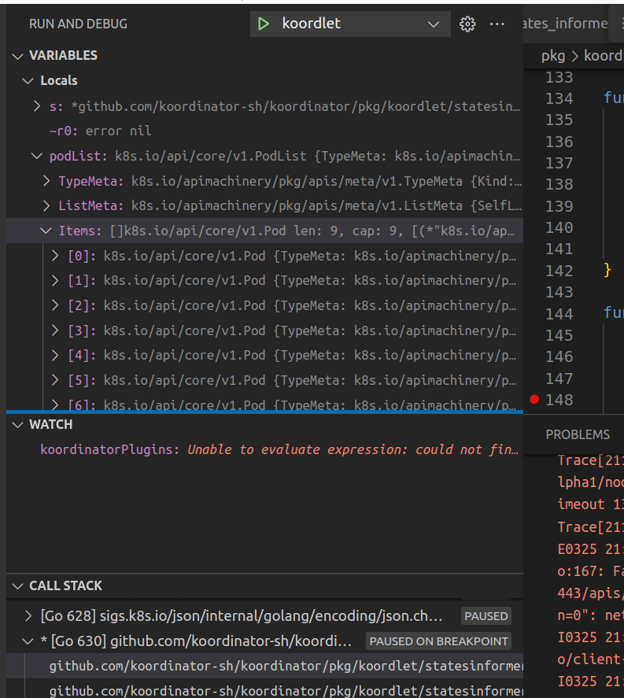
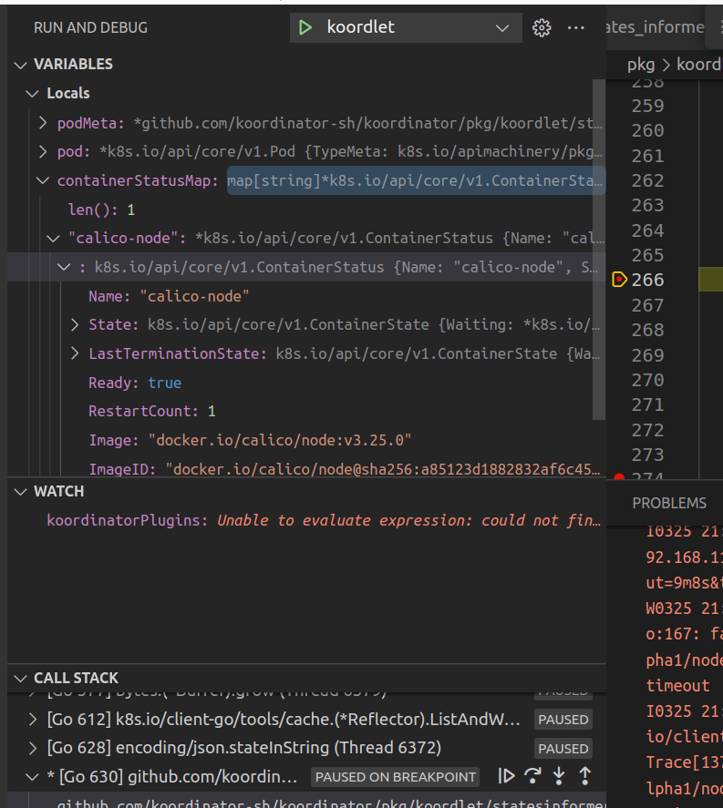

1、pod Informer 就是为了记录 podMeta 以及cpu 内存的指标信息到prome库

podInformer -> localhost:10250 获取本机的pod列表





recordContainerResourceMetrics() 记载的是 pod记录的batchCpu batchMemory MidCpu MidMemory

recordContainerResourceMetrics 是把 pod的cpu和memory 信息记录到prometheus metric 库里

## 2、NewPVCInformer

```
从apiserver 上写到内存里
```

## 3、nodeInformer

记录 node 的batchcpu  batch memory 到prome

把 node 数据存到内存里


## 4、nodeMetricInformer
安装nodemetric
```
kubectl apply -f https://github.com/kubernetes-sigs/metrics-server/releases/latest/download/components.yaml
```

nodeMetricInformer 还会定时同步metric到 prodPredictor 和 statusUpdater。 nodeMetricInformer的
collectMetric是⼀个⼗分重要的函数

并且记录到prome 库

```
__attribute__((section("maps"), used))
struct bpf_map_def tmp_storage_map = {
    .type = BPF_MAP_TYPE_PERCPU_ARRAY,
    .key_size = sizeof(u32),
    .value_size = PATH_MAX,
    .max_entries = 1,
};

res = bpf_probe_read(&pathname, sizeof(pathname), &regs->si);

map_id = 0;
map_value = bpf_map_lookup_elem(&tmp_storage_map, &map_id);
if (!map_value)
    return 0;

res = bpf_probe_read_str(map_value, PATH_MAX, pathname);
```