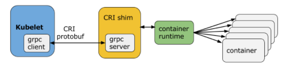
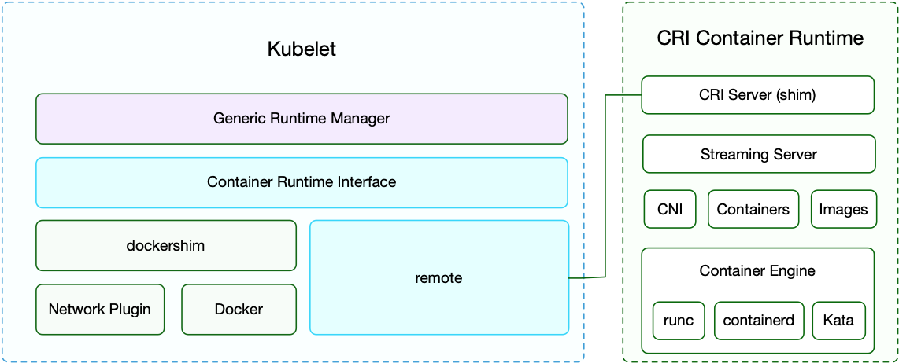
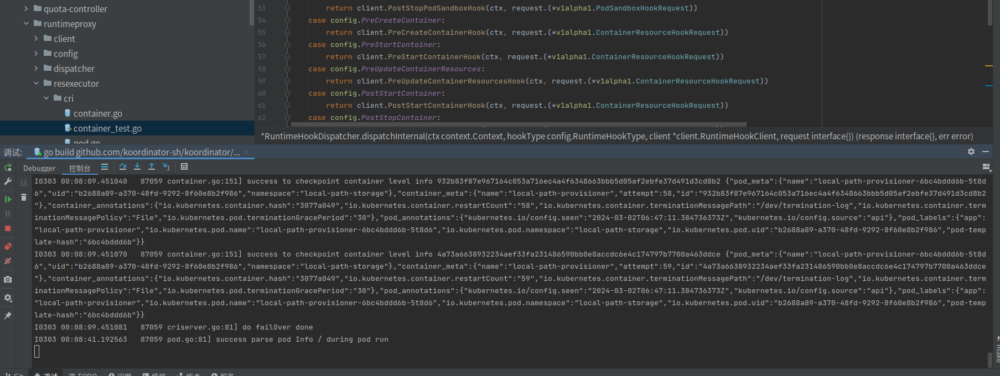
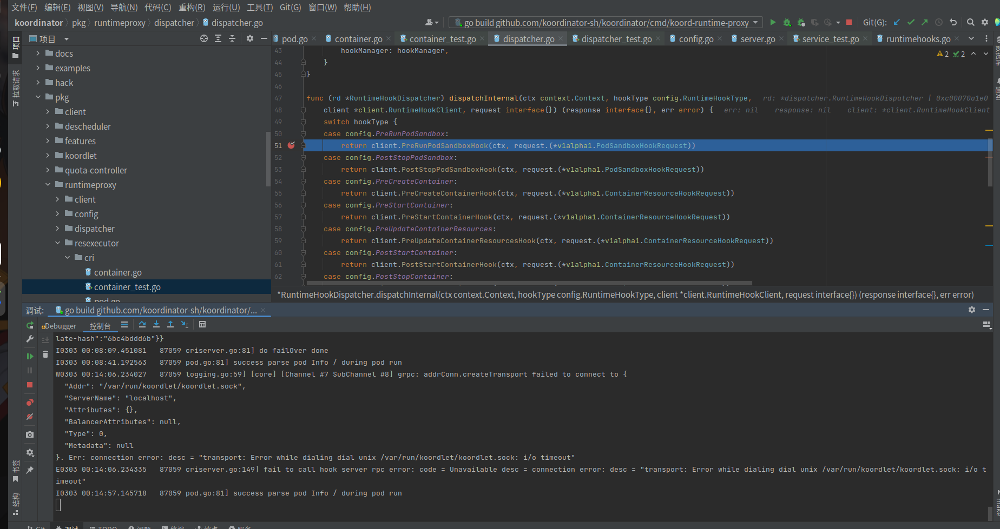

# RuntimeProxy源码分析
文章分析主要分为静态分析和 动态分析，由于runtimeproxy模块默认是containerd，所以本次只单用containerd做分析，不分析docker运行时，因为docker逻辑和containerd逻辑差不多，所以单分析containerd就很有代表性了。

## 一、分析环境

koordnator软件版本

```
v1.4.0
```

运行环境

```
ubuntu21.04
```


## 二、启动参数分析


|参数名称	                         |描述 |默认值|
|---------------------------------|------------------------------------------------------------------------------------------------------------------------------|------------------------------|
|koord-runtimeproxy-endpoint |	runtimeproxy启动后会监听这个endpoint，如果有cri请求到达，会中转到   remote-runtime-service-endpoint                                        | /var/run/koord-runtimeproxy/runtimeproxy.sock|
|remote-runtime-service-endpoint	 |连接容器运行时，比如docker.sock或者containerd.sock,用来操作容器运行时                                                                   |/var/run/containerd/containerd.sock|            
|backend-runtime-mode	         |后台运行模式 (Docker、Containerd)                                      |Containerd|
|runtime-hook-server-key	                 | |   |
|runtime-hook-server-val| ||

## 三、静态代码分析

runtimeproxy 核心功能只有一句话，就是拦截发往CRI的请求，然后转发给koordlet做处理，然后收到koordlet的响应结果后继续转发给CRI

官网相关资料参考地址:

```
https://koordinator.sh/zh-Hans/docs/designs/runtime-proxy/
```

### 1、config-manager模块分析

config-manager用来管理runtime插件的配置，在配置文件发生变化的时候可以自动更新 配置

监听目录为 

```
 /etc/runtime/hookserver.d/
```

监听配置文件必须为.json后缀,例如文件/etc/runtime/hookserver.d/koordlet.json，demo内容

```
 {
    "remote-endpoint": "/var/run/koordlet/koordlet.sock",
    "failure-policy": "Ignore",
    "runtime-hooks": [
        "PreRunPodSandbox",
        "PreCreateContainer",
        "PreStartContainer"
    ]
}
```

failure-policy: 调用插件失败时的策略，失败或忽略，默认为忽略。
remote-endpoint: KoordRuntimeProxy 与插件对话端点，由插件生成。

failure-policy 目前支持俩值Fail 和 Ignore，具体代码定义:

```
const (
	// PolicyFail returns error to caller when got an error cri hook server
	PolicyFail FailurePolicyType = "Fail"
	// PolicyIgnore transfer cri request to containerd/dockerd when got an error to cri serer
	PolicyIgnore FailurePolicyType = "Ignore"
	// PolicyNone when no Policy configured. Proxy would ignore errors for PolicyNone like PolicyIgnore.
	PolicyNone = ""
)
```

核心是使用linux的inotify机制，监听目录，当目录下有文件发生变化的时候，会触发回调函数，执行相应的操作。linux inotify机制的详细介绍可以参考[linux inotify机制](https://man7.org/linux/man-pages/man7/inotify.7.html)

koordinator 核心实现代码

pkg/runtimeproxy/config/config_manager.go

创建inotify 事件，位于Manager->Run中

```
watcher, err := fsnotify.NewWatcher()
```

添加监听文件 Manager->registerFileToWatchIfNeed

```

func (m *Manager) registerFileToWatchIfNeed(file string) error {
	fileInfo, err := os.Stat(file)
	if err != nil {
		return err
	}
	stat, ok := fileInfo.Sys().(*syscall.Stat_t)
	if !ok {
		return fmt.Errorf("fail to get file ino: %v", file)
	}
	m.Lock()
	defer m.Unlock()
	config, exist := m.configs[file]
	if exist && config.fileIno == stat.Ino {
		return nil
	}
	if exist && config.fileIno != stat.Ino {
		m.watcher.Remove(file)
		klog.Infof("remove previous file %v with inode number %v", file, config.fileIno)
	}
	m.watcher.Add(file)
	m.configs[file] = &RuntimeHookConfigItem{
		filePath: file,
		fileIno:  stat.Ino,
	}
	klog.Infof("add new watching file %v with inode number %v", file, stat.Ino)
	return nil
}
```
监听配置文件变化

```
func (m *Manager) syncLoop() error {
	for {
		select {
		case event, ok := <-m.watcher.Events:
			if !ok {
				klog.Infof("config manager channel is closed")
				return nil
			}
			// only reload config when write/rename/remove events
			if event.Op&(fsnotify.Chmod) > 0 {
				klog.V(5).Infof("ignore event from runtime hook config dir %v", event)
				continue
			}
			// should add the config file to watcher if event.Op is fsnotify.Create
			klog.V(5).Infof("receive change event from runtime hook config dir %v", event)
			m.updateHookConfig(event.Name)
		case err := <-m.watcher.Errors:
			if err != nil {
				klog.Errorf("failed to continue to sync %v", defaultRuntimeHookConfigPath)
			}
		}
	}
}
```

监听到配置变化后使用,更新到内存中。

```
Manager->updateHookConfig
```

### 2、criServer 模块分析

#### CRI 简介

容器运行时插件（Container Runtime Interface，简称 CRI）是 Kubernetes v1.5 引入的容器运行时接口，它将 Kubelet 与容器运行时解耦，将原来完全面向 Pod 级别的内部接口拆分成面向 Sandbox 和 Container 的 gRPC 接口，并将镜像管理和容器管理分离到不同的服务。



采用 CRI 后，Kubelet 的架构如下图所示:



CRI 接口
CRI 基于 gRPC 定义了 RuntimeService 和 ImageService 等两个 gRPC 服务，分别用于容器运行时和镜像的管理。其定义在

```
v1.14 以以上：https://github.com/kubernetes/cri-api/tree/master/pkg/apis/runtime
v1.10-v1.13: pkg/kubelet/apis/cri/runtime/v1alpha2
v1.7-v1.9: pkg/kubelet/apis/cri/v1alpha1/runtime
v1.6: pkg/kubelet/api/v1alpha1/runtime
```

常见CRI运行时:

|CRI 容器运行时	                         |维护者 |主要特性|容器引擎|
|---------------------------------|------------------------------------------------------------------------------------------------------------------------------|------------------------------|-----|
|Dockershim |	Kubernetes| 内置实现、特性最新|docker|
|cri-o |Kubernetes |OCI标准不需要Docker|OCI（runc、kata、gVisor…）|  
|cri-containerd |Containerd |基于 containerd 不需要Docker|OCI（runc、kata、gVisor…）|
|Frakti|Kubernetes|虚拟化容器|hyperd、docker|
|rktlet|Kubernetes|支持rkt|rkt|
|PouchContainer|Alibaba|富容器|OCI（runc、kata…）|
|Virtlet|Mirantis|Mirantis|Libvirt（KVM）|

#### CRI-SERVER 源码解析

koordinator runtimeproxy的核心逻辑是使用 cri协议监听，域套接字文件，例如，文件为:

```
/var/run/koord-runtimeproxy/runtimeproxy.sock
```

然后 再和容器运行时监听的套接字文件建立连接，当runtimeproxy.sock 的server 收到 数据后，再进行一系列intercept 然后转发到 containerd.sock，实现对容器的管控，例如，转发给的sock文件为：

```
/var/run/containerd/containerd.sock
```

整体架构图:



和容器运行时containerd 建立client连接，用来转发proxy收到的数据
核心代码位于pkg/runtimeproxy/server/cri/criserver.go的 RuntimeManagerCriServer->initCriServer 中
```
func (c *RuntimeManagerCriServer) initCriServer(runtimeSockPath string) (*grpc.ClientConn, error) {
	generateGrpcConn := func(sockPath string) (*grpc.ClientConn, error) {
		ctx, cancel := context.WithTimeout(context.Background(), defaultTimeout)
		defer cancel()
		return grpc.DialContext(ctx, sockPath, grpc.WithInsecure(), grpc.WithContextDialer(dialer))
	}
	runtimeConn, err := generateGrpcConn(runtimeSockPath)
	if err != nil {
		klog.Errorf("fail to create runtime service client %v", err)
		return nil, err
	} else {
		klog.Infof("success to create runtime client %v", runtimeSockPath)
	}

	// According to the version of cri api supported by backend runtime, create the corresponding cri server.
	_, v1Err := runtimeapi.NewRuntimeServiceClient(runtimeConn).Version(context.Background(), &runtimeapi.VersionRequest{})
	if v1Err == nil {
		c.criServer = &criServer{
			RuntimeRequestInterceptor:   c,
			backendRuntimeServiceClient: runtimeapi.NewRuntimeServiceClient(runtimeConn),
		}
	}
	_, alphaErr := runtimeapialpha.NewRuntimeServiceClient(runtimeConn).Version(context.Background(), &runtimeapialpha.VersionRequest{})
	if alphaErr == nil {
		c.criAlphaServer = &criAlphaServer{
			RuntimeRequestInterceptor:   c,
			backendRuntimeServiceClient: runtimeapialpha.NewRuntimeServiceClient(runtimeConn),
		}
	}
	if c.criServer == nil && c.criAlphaServer == nil {
		err = fmt.Errorf("%s, %s", v1Err.Error(), alphaErr.Error())
		klog.Errorf("fail to create cri service %v", err)
		return nil, err
	}
	return runtimeConn, nil
}
```

和 containerd运行时监听的套接字文件建立好连接后，监听runtimeproxy.sock
核心代码位于 pkg/runtimeproxy/server/cri/criserver.go
```
	klog.Infof("do failOver done")

	listener, err := net.Listen("unix", options.RuntimeProxyEndpoint)
	if err != nil {
		klog.Errorf("failed to create listener, error: %v", err)
		return err
	}

	// For unsupported requests, pass through directly to the backend
	director := func(ctx context.Context, fullName string) (context.Context, *grpc.ClientConn, error) {
		return ctx, remoteConn, nil
	}
	grpcServer := grpc.NewServer(
		grpc.UnknownServiceHandler(proxy.TransparentHandler(director)),
	)
	if c.criServer != nil {
		runtimeapi.RegisterRuntimeServiceServer(grpcServer, c.criServer)
	}
	if c.criAlphaServer != nil {
		runtimeapialpha.RegisterRuntimeServiceServer(grpcServer, c.criAlphaServer)
	}
	err = grpcServer.Serve(listener)
	return err
```

当有请求过来的时候,会触发pkg/runtimeproxy/server/cri/runtime.go,当触发容器运行时的这些钩子的时候会触发InterceptRuntimeRequest.

```
// 运行pod沙盒
func (c *criServer) RunPodSandbox(ctx context.Context, req *runtimeapi.RunPodSandboxRequest) (*runtimeapi.RunPodSandboxResponse, error) {
	rsp, err := c.InterceptRuntimeRequest(RunPodSandbox, ctx, req,
		func(ctx context.Context, req interface{}) (interface{}, error) {
			return c.backendRuntimeServiceClient.RunPodSandbox(ctx, req.(*runtimeapi.RunPodSandboxRequest))
		}, false)
	if err != nil {
		return nil, err
	}
	return rsp.(*runtimeapi.RunPodSandboxResponse), err
}

// 停止pod沙盒
func (c *criServer) StopPodSandbox(ctx context.Context, req *runtimeapi.StopPodSandboxRequest) (*runtimeapi.StopPodSandboxResponse, error) {
}

// 创建容器
func (c *criServer) CreateContainer(ctx context.Context, req *runtimeapi.CreateContainerRequest) (*runtimeapi.CreateContainerResponse, error) {
}

...............................
```

runtime-hooks: 目前有7个钩点：
PreRunPodSandbox
PreCreateContainer
PreStartContainer
PostStartContainer
PreUpdateContainerResources
PostStopContainer
PostStopPodSandbox

KoordRunmeProxy 和 Plugins 之间的协议
Protocols

```
https://github.com/koordinator-sh/koordinator/blob/main/apis/runtime/v1alpha1/api.proto
```

### 3、Intercept 模块源码分析

intercept 核心源码解析，当有请求runtimeproxy.sock的时候，会触发InterceptRuntimeRequest拦截请求然后转发给容器运行时。

```


func (c *RuntimeManagerCriServer) InterceptRuntimeRequest(serviceType RuntimeServiceType,
	ctx context.Context, request interface{}, handler grpc.UnaryHandler, alphaRuntime bool) (interface{}, error) {
	// 通过serviceType获取钩子信息，serviceType值为上面说的 runtime-hooks 的7个钩子点,然后获取钩子点以及运行时的资源信息，到底是Container 还是 Pod
	runtimeHookPath, runtimeResourceType := c.getRuntimeHookInfo(serviceType)

	// 通过资源信息Pod 或者container 实例化Executor
	resourceExecutor := resource_executor.NewRuntimeResourceExecutor(runtimeResourceType)

	var err error
	if alphaRuntime {
		request, err = alphaObjectToV1Object(request)
		if err != nil {
			return nil, err
		}
	}
	// 解析请求，并且从缓存中检查容器是否故障，如果容器已经故障，则不会继续执行下面逻辑，详细看下面的故障转移
	callHookOperation, err := resourceExecutor.ParseRequest(request)
	if err != nil {
		klog.Errorf("fail to parse request %v %v", request, err)
	}
	defer resourceExecutor.DeleteCheckpointIfNeed(request)

	//	是否需要触发钩子，如果需要则触发RuntimeHookDispatcher
	switch callHookOperation {
	case utils.ShouldCallHookPlugin:
		// TODO deal with the Dispatch response
		// 这个 c.hookDispatcher.Dispatch 是Hook的关键，会把CRI请求转发给koordlet.sock做特殊处理，然后等待koordlet模块处理完成
		response, err, policy := c.hookDispatcher.Dispatch(ctx, runtimeHookPath, config.PreHook, resourceExecutor.GenerateHookRequest())
		if err != nil {
			klog.Errorf("fail to call hook server %v", err)
			if policy == config.PolicyFail {
				return nil, fmt.Errorf("hook server err: %v", err)
			}
		} else if response != nil {
			if err = resourceExecutor.UpdateRequest(response, request); err != nil {
				klog.Errorf("failed to update cri request %v", err)
			}
		}
	}
	// call the backend runtime engine
	if alphaRuntime {
		request, err = v1ObjectToAlphaObject(request)
		if err != nil {
			return nil, err
		}
	}
	res, err := handler(ctx, request)
	responseConverted := false
	if err == nil {
		if alphaRuntime {
			responseConverted = true
			res, err = alphaObjectToV1Object(res)
			if err != nil {
				return nil, err
			}
		}
		klog.Infof("%v call containerd %v success", resourceExecutor.GetMetaInfo(), string(runtimeHookPath))
		// store checkpoint info basing request only when response success
		if err := resourceExecutor.ResourceCheckPoint(res); err != nil {
			klog.Errorf("fail to checkpoint %v %v", resourceExecutor.GetMetaInfo(), err)
		}
	} else {
		klog.Errorf("%v call containerd %v fail %v", resourceExecutor.GetMetaInfo(), string(runtimeHookPath), err)
	}
	switch callHookOperation {
	case utils.ShouldCallHookPlugin:
		// post call hook server
		// TODO the response
		// 这个 c.hookDispatcher.Dispatch 是Hook的关键，会把CRI请求转发给koordlet.sock做特殊处理，然后等待koordlet模块处理完成
		c.hookDispatcher.Dispatch(ctx, runtimeHookPath, config.PostHook, resourceExecutor.GenerateHookRequest())
	}
	// 是否需要加工响应数据，返回给容器运行时
	if responseConverted {
		res, err = v1ObjectToAlphaObject(res)
		if err != nil {
			return nil, err
		}
	}
	return res, err
}

```

RuntimeHookDispatcher 的 Dispatch是runtimeproxy代码的核心，通过拦截请求转发给/var/run/koordlet/koordlet.sock，从而使koordlet做特殊处理，下面对Dispatch核心模块做分析。

核心代码位于pkg/runtimeproxy/dispatcher/dispatcher.go

当触发Dispatcher后，通过

```
hookServers := rd.hookManager.GetAllHook() 
```
获取全部配置信息，由于存在另一个协程自动更新配置，所以内部实现带锁

```

for _, hookServer := range hookServers {
	for _, hookType := range hookServer.RuntimeHooks {
		// 是否是要处理的 runtime钩子点
		if !hookType.OccursOn(runtimeRequestPath) {
			continue
		}
		// 钩子阶段是否是配置文件中要处理的阶段
		if hookType.HookStage() != stage {
			continue
		}
		// 从koordlet客户端连接池中和koordlet.sock建立一个连接
		client, err := rd.cm.RuntimeHookServerClient(client.HookServerPath{
			Path: hookServer.RemoteEndpoint,
		})
		if err != nil {
			klog.Errorf("fail to get client %v", err)
			continue
		}
		// currently, only one hook be called during one runtime
		// TODO: multi hook server to merge response
		// 派遣请求给koordlet
		rsp, err := rd.dispatchInternal(ctx, hookType, client, request)
		if err != nil {
			return nil, err, hookServer.FailurePolicy
		}
		return rsp, err, hookServer.FailurePolicy
	}
}
```

具体派遣的钩子点:

```
func (rd *RuntimeHookDispatcher) dispatchInternal(ctx context.Context, hookType config.RuntimeHookType,
	client *client.RuntimeHookClient, request interface{}) (response interface{}, err error) {
	switch hookType {
	case config.PreRunPodSandbox:
		return client.PreRunPodSandboxHook(ctx, request.(*v1alpha1.PodSandboxHookRequest))
	case config.PostStopPodSandbox:
		return client.PostStopPodSandboxHook(ctx, request.(*v1alpha1.PodSandboxHookRequest))
	case config.PreCreateContainer:
		return client.PreCreateContainerHook(ctx, request.(*v1alpha1.ContainerResourceHookRequest))
	case config.PreStartContainer:
		return client.PreStartContainerHook(ctx, request.(*v1alpha1.ContainerResourceHookRequest))
	case config.PreUpdateContainerResources:
		return client.PreUpdateContainerResourcesHook(ctx, request.(*v1alpha1.ContainerResourceHookRequest))
	case config.PostStartContainer:
		return client.PostStartContainerHook(ctx, request.(*v1alpha1.ContainerResourceHookRequest))
	case config.PostStopContainer:
		return client.PostStopContainerHook(ctx, request.(*v1alpha1.ContainerResourceHookRequest))
	}
	return nil, status.Errorf(codes.Unimplemented, fmt.Sprintf("method %v not implemented", string(hookType)))
}
```

### 4、故障转移

启动时候运行一次，拉取pod、容器信息列表，并且写入store缓存中，具体实现代码位于

pkg/runtimeproxy/server/cri/criserver.go的 RuntimeManagerCriServer->failOver

```
func (c *RuntimeManagerCriServer) failOver() error {
	// Try CRI v1 API first. If the backend runtime does not support the v1 API, fall back to using the v1alpha2 API instead.
	podResponse := &runtimeapi.ListPodSandboxResponse{}
	// 拉取pod列表
	var err error
	if c.criServer != nil {
		podResponse, err = c.criServer.backendRuntimeServiceClient.ListPodSandbox(context.TODO(), &runtimeapi.ListPodSandboxRequest{})
		if err != nil {
			return err
		}
	} else {
		podResponseAlpha, err := c.criAlphaServer.backendRuntimeServiceClient.ListPodSandbox(context.TODO(), &runtimeapialpha.ListPodSandboxRequest{})
		if err != nil {
			return err
		}
		err = convert(podResponseAlpha, podResponse)
		if err != nil {
			return err
		}
	}

	for _, pod := range podResponse.Items {
		podResourceExecutor := cri_resource_executor.NewPodResourceExecutor()
		podResourceExecutor.ParsePod(pod)
		// 检查POD节点是否存活，并且写入缓存
		podResourceExecutor.ResourceCheckPoint(&runtimeapi.RunPodSandboxResponse{
			PodSandboxId: pod.GetId(),
		})
	}

	// 获取容器列表
	var containerResponse *runtimeapi.ListContainersResponse
	if c.criServer != nil {
		containerResponse, err = c.criServer.ListContainers(context.TODO(), &runtimeapi.ListContainersRequest{})
		if err != nil {
			return err
		}
	} else {
		containerResponseAlpha, err := c.criAlphaServer.ListContainers(context.TODO(), &runtimeapialpha.ListContainersRequest{})
		if err != nil {
			return err
		}
		err = convert(containerResponseAlpha, podResponse)
		if err != nil {
			return err
		}
	}
	for _, container := range containerResponse.Containers {
		containerExecutor := cri_resource_executor.NewContainerResourceExecutor()
		if err := containerExecutor.ParseContainer(container); err != nil {
			klog.Errorf("failed to parse container %s, err: %v", container.Id, err)
			continue
		}
		// 检查Contaier节点是否存活，并且写入缓存
		containerExecutor.ResourceCheckPoint(&runtimeapi.CreateContainerResponse{
			ContainerId: container.GetId(),
		})
	}

	return nil
}
```

当有人使用 ParseRequest 的时候，接口位于pkg/runtimeproxy/resexecutor/resource_executor.go，实现代码以Container为例pkg/runtimeproxy/cri/container.go,每次使用InterceptRuntimeRequest的时候会触发ParseRequest，在这里会做检查，如果说container缓存不存在，则会报错，从而阻止InterceptRuntimeRequest继续向下请求。

```
func (c *ContainerResourceExecutor) ParseRequest(req interface{}) (utils.CallHookPluginOperation, error) {
..............
	
	podCheckPoint := store.GetPodSandboxInfo(podID)
	if podCheckPoint == nil {
		err = fmt.Errorf("fail to get pod(%v) related to container", podID)
		break
	}
}
```


## 四、动态分析

分析目的，验证 runtimeproxy的功能拦截请求转发给koordlet


### 1、启动runtimeproxy

```
touch /etc/runtime/hookserver.d/koordlet.json
```

vim  /etc/runtime/hookserver.d/koordlet.json 修改文件内容

```
{
    "remote-endpoint": "/var/run/koordlet/koordlet.sock",
    "failure-policy": "Fail",
    "runtime-hooks": [
        "PreRunPodSandbox",
        "PreCreateContainer",
        "PreStartContainer"
    ]
}
```

runtime的启动参数,由于我在本机使用了kind进行测试所以必须加/proc/{pid}/root

```
--remote-runtime-service-endpoint /proc/4299/root/run/containerd/containerd.sock
```

运行runtimeproxy模块



### 2、编写cri客户端测试程序

核心代码位于

```
https://github.com/LeiZhang-Hunter/cri-test
```

稍微编写用例改为:
```
func main() {
	InitRuntimeClient()
	all, err := GetRuntimeClient().PreRunPodSandbox()
	if err != nil {
		return
	}
	fmt.Println(all)
	return
}
```

编译二进制，并且运行

```
go build main.go && ./main
```

### 3、验证是否拦截了RunPodSandbox

如果进行拦截，下一步runtime-proxy 会把请求转发给koordlet，通过打断点验证



发现命中断点

由于没起koordlet，但是我们可以通过报错分析,确实有请求数据转发给了koordlet

```
W0303 00:14:06.234027   87059 logging.go:59] [core] [Channel #7 SubChannel #8] grpc: addrConn.createTransport failed to connect to {
  "Addr": "/var/run/koordlet/koordlet.sock",
  "ServerName": "localhost",
  "Attributes": {},
  "BalancerAttributes": null,
  "Type": 0,
  "Metadata": null
}. Err: connection error: desc = "transport: Error while dialing dial unix /var/run/koordlet/koordlet.sock: i/o timeout"
E0303 00:14:06.234335   87059 criserver.go:149] fail to call hook server rpc error: code = Unavailable desc = connection error: desc = "transport: Error while dialing dial unix /var/run/koordlet/koordlet.sock: i/o timeout"

```